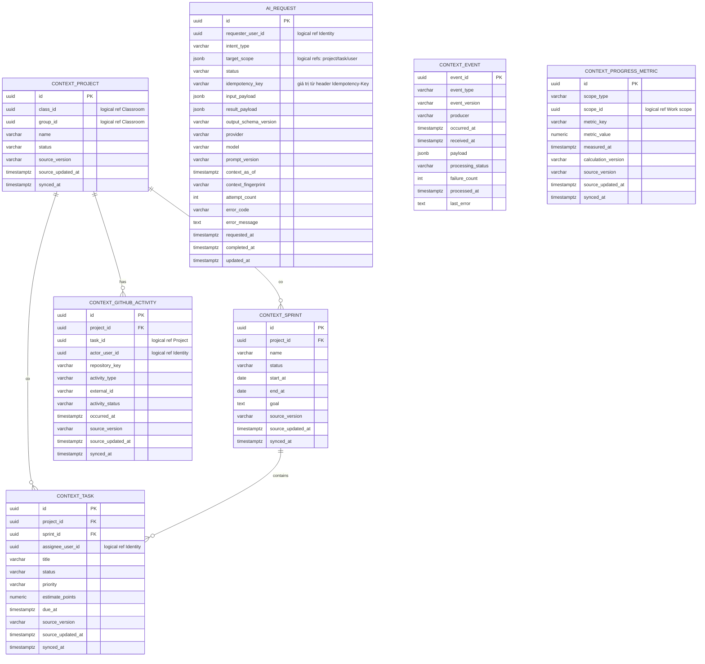

# ERD AI Service — MVP

**Trạng thái: Thiết kế mục tiêu; chưa triển khai và chưa có migration để kiểm chứng.**

ERD dưới đây là phương án persistence của thiết kế AI trước; baseline mục
4.6 cho lấy context qua internal API. `AI_REQUEST` phục vụ yêu cầu/kết quả;
các bảng `CONTEXT_*` chỉ triển khai khi chọn lưu snapshot/projection qua event.
Không bắt buộc tạo toàn bộ bảng chỉ để chạy internal-context API. Xem
[kiến trúc AI](architecture.md) và [baseline](../architecture/README.md).

Request/kết quả và ý định giao job bền vững là bắt buộc cho
[pipeline API/worker đã chốt](architecture.md). Projection context vẫn tùy
use case. ERD hiện chưa đặc tả đủ cơ chế giao job/phục hồi; các yêu cầu dưới
đây phải được chuyển thành schema/migration có kiểm thử khi triển khai.

Phạm vi dữ liệu mục tiêu:

1. yêu cầu và kết quả AI;
2. projection (bản sao đọc tối thiểu) của project/task/sprint;
3. một vài chỉ số tiến độ và hoạt động GitHub đã chuẩn hóa;
4. event đã nhận để chống xử lý trùng.
5. ý định giao job và metadata phục hồi; outbox event kết quả chỉ khi có contract.

Các bảng nguồn vẫn thuộc service nghiệp vụ tương ứng. Những ID như `user_id`,
`project_id` và `scope_id` trỏ sang service khác là logical reference, không
phải foreign key xuyên database.

## ERD MVP

## Vai trò của các bảng đề xuất

- `ai_request` chứa cả trạng thái, metadata lần gọi và kết quả JSON đã validate.
  Với MVP, chỉ lưu lần xử lý hiện tại; chưa cần tách `ai_run`, `ai_result` và
  `ai_suggestion`.
- `target_scope` ghi rõ request áp dụng cho project, task hoặc user nào. Các ID
  trong đó là logical reference; không phải foreign key sang database khác.
- `context_project` và `context_task` đủ cho các use case tạo backlog và phân rã
  task; `context_sprint`, `context_progress_metric` và
  `context_github_activity` bổ sung dữ liệu cho `risk_analysis`.
- `context_progress_metric` cho phép AI diễn giải chỉ số do Work Service
  tính; AI không tự tính lại chỉ số nguồn.
- `context_event` giữ `event_id` và trạng thái xử lý để consumer Kafka
  idempotent. Đây là bảng vận hành, không thay thế event contract.

Context được lưu như **trạng thái mới nhất**, không phải lịch sử đầy đủ. Các
cột `source_version`, `source_updated_at`, `synced_at` và `context_as_of` cho
biết kết quả AI đã dùng dữ liệu đến thời điểm nào.

## Ràng buộc và index đề xuất khi chọn persistence này

Các ràng buộc dưới đây cần xác minh theo schema/API thực tế trước migration.
Với job `queued` chưa được chạy, cần chốt cách đếm attempt trước khi dùng
`attempt_count >= 1`; không áp dụng CHECK này như schema production đã chốt.

- Khóa chính dùng `uuid`; thời gian dùng `timestamptz`.
- `UNIQUE (requester_user_id, idempotency_key)` trên `ai_request` khi key khác
  `NULL`.
- `CHECK` cho `status`; ràng buộc `attempt_count` cần chốt cách đếm job chưa
  bắt đầu và retry trước migration.
- `CHECK (jsonb_typeof(input_payload) = 'object')` nếu API luôn nhận object.
- Index `ai_request (requester_user_id, requested_at DESC)` và
  `ai_request (status, requested_at DESC)`.
- Index `context_task (project_id, status, due_at)` và
  `context_task (assignee_user_id, status, due_at)`.
- Index `context_github_activity (project_id, occurred_at DESC)` và
  `context_github_activity (task_id, occurred_at DESC)`.
- Index `context_progress_metric (scope_type, scope_id, metric_key,
measured_at DESC)`.
- Primary key trên `context_event.event_id`; index retry theo
  `(processing_status, received_at)`.

## Khi nào cần mở rộng?

Chỉ thêm bảng khi có yêu cầu thật:

- Tách `ai_execution` nếu cần lưu lịch sử retry, token usage hoặc nhiều kết
  quả cho một request.
- Tách `ai_suggestion` nếu UI cần truy vấn/chấp nhận từng gợi ý độc lập thay vì
  đọc một `result_payload`.
- Thêm context project member hoặc group member khi use case AI tương ứng được
  chốt.
- Thêm bảng lineage chi tiết nếu cần audit chính xác từng bản ghi context đã
  được dùng.

Không đưa vào MVP: user/project/task nguồn, vector database, conversation dài
hạn, raw provider response và trạng thái “đã áp dụng” của suggestion. Việc áp
dụng thay đổi vẫn do service sở hữu domain thực hiện sau khi người dùng xác
nhận.

## Persistence phục vụ pipeline API/worker

**Thiết kế mục tiêu; chưa có schema/migration được xác minh.** API và Celery
worker dùng chung database của AI qua application/repository. Redis chuyển
task; trạng thái và kết quả bền vững nằm trong PostgreSQL của AI.

- Request `queued` và bản ghi chờ giao job phải lưu trong cùng transaction
  trước khi xác nhận nhận job. Dispatcher đọc bản ghi đó để gửi hoặc giao lại
  qua Redis; cần phân biệt đã gửi task với đã hoàn tất xử lý.
- Idempotency cần fingerprint payload, phạm vi user/key và bảo vệ nhiều POST
  đồng thời. Worker cũng phải chống xử lý trùng khi task được giao lại.
- Cần metadata để worker nhận quyền xử lý, phục hồi sau khi worker chết và
  ngăn worker cũ ghi đè kết quả mới. Request đã kết thúc không chạy lại LLM.
- Lưu trạng thái cuối `succeeded`/`failed`, result/error và context metadata
  để API đọc sau kiểm tra ownership. Không cần consumer event kết quả để API
  cập nhật database.
- Khi đã có contract Kafka event kết quả, lưu kết quả và outbox trong cùng
  transaction. Dead-letter cần thông tin thông điệp, nguồn, lỗi và số lần xử
  lý phù hợp để điều tra/replay; không tự tạo topic hoặc schema chưa chốt.

Tên bảng, cột, cơ chế nhận quyền xử lý, retention và index cho các yêu cầu này
chưa được chốt. Không coi ERD `AI_REQUEST` hiện tại là đủ để bảo đảm giao job,
retry hay phục hồi. Quy tắc thực thi nằm trong [kiến trúc AI](architecture.md).

## Quyết định cần chốt trước migration

1. Output schema cụ thể cho `backlog_generation`, `task_decomposition` và
   `risk_analysis`.
2. Quyền gọi `task_decomposition` của Member hay chỉ Leader.
3. Có cần projection Kafka hay chỉ snapshot context từ internal API. Nếu dùng
   Kafka, version/mapping contract cũ với Work và retention của `context_event`.
4. Retention/ẩn danh cho `input_payload`, `result_payload` và event payload.
5. Có cần tách lịch sử execution ngay từ v1 hay chấp nhận lưu lần xử lý hiện
   tại trong `ai_request`.

Baseline không ấn định ORM hoặc tên database AI; `ai_context_db` là tên trong
thiết kế AI trước, chưa có trong Compose/init script. Job scheduling/outbox,
claim job (nhận quyền xử lý), phục hồi retry/dead-letter và credential riêng
cần được đặc tả schema trước migration theo các yêu cầu pipeline đã chốt;
không tự thêm bảng/index giả trong lần cập nhật tài liệu này.
