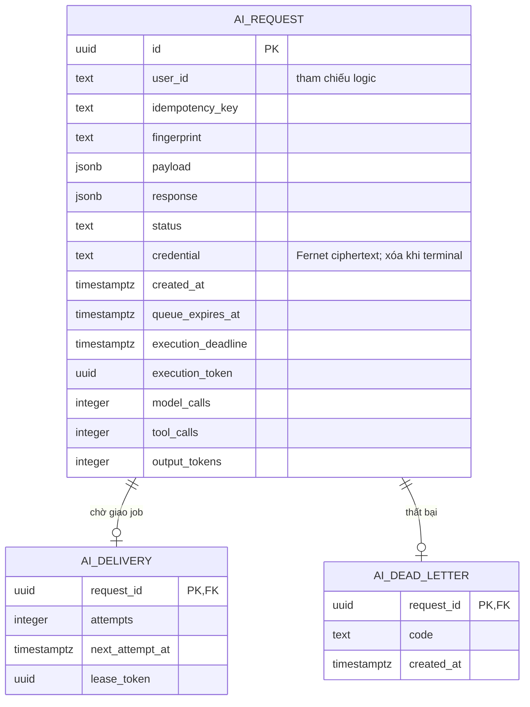

# ERD AI Service — MVP

**Trạng thái: Đã triển khai schema và repository PostgreSQL; production chưa
xác minh.** Nguồn thực thi là
[migration 0001](../../apps/ai-service/migrations/versions/0001_request_pipeline.py)
và [ORM metadata](../../apps/ai-service/src/infrastructure/db/tables.py).
Không giữ các bảng projection cũ như schema bắt buộc khi pipeline dùng REST.

## ERD MVP

## Vai trò của các bảng đề xuất

Tên bảng SQL là `ai_request`, `ai_delivery`, `ai_dead_letter`; chúng là schema
đã triển khai, không còn là placeholder. `user_id` và ID trong payload không
có FK xuyên service. Hai FK trên chỉ nằm trong AI database.

- Request giữ input đã chuẩn hóa, response hiện tại, ownership/idempotency và
  metadata thực thi. Response JSONB chứa result/error/context metadata v1.
- Delivery giữ ý định giao job cùng transaction request, lease/attempts/thời
  điểm giao lại. Publish thành công không xóa ý định; worker claim mới xóa,
  tránh mất job nếu Redis làm mất thông điệp trước khi worker nhận.
- Dead-letter giữ mã lỗi terminal và thời điểm, không chứa token/raw output.

## Ràng buộc và index đề xuất khi chọn persistence này

**Đã triển khai:** UUID PK, JSONB cho payload/response, timestamptz UTC,
unique `(user_id, idempotency_key)`, check status/budget không âm, index delivery
đến hạn và request expiry. Repository dùng connection pool, transaction ngắn;
không giữ transaction/lock trong lúc gọi broker, REST hoặc LLM.

`INSERT ... ON CONFLICT` bảo vệ POST đồng thời. Claim request khóa hàng;
claim delivery dùng `FOR UPDATE SKIP LOCKED`. Finish kiểm tra execution token,
status và deadline. Budget trừ trước model/tool, tính usage output và cấp cap
còn lại cho lần model tiếp theo. Xem [pipeline](architecture.md).

## Khi nào cần mở rộng?

Context snapshot/projection, execution history, Kafka outbox và specialist
chỉ thêm khi có use case/contract. Không lưu raw LLM output hoặc dùng projection
để cấp quyền. Retention/ẩn danh tự động và replay dead-letter chưa triển khai.

## Persistence phục vụ pipeline API/worker

API, dispatcher và worker dùng chung PostgreSQL của AI; Redis chỉ là broker.
Bearer cần cho reauthorization tại worker được mã hóa bằng khóa Fernet ngoài
source, cùng khóa ở API/worker. JWT còn được kiểm tra issuer/audience/expiry
sau giải mã. Ciphertext bị xóa khi succeeded/failed, kể cả queue timeout,
worker timeout và dispatch hết retry. Payload/result cần policy retention riêng.

Worker chết không được chạy lại model trên request đang running; dispatcher
lưu failed khi deadline hết. Không đặt lại budget hoặc cho worker cũ ghi đè.
Không chạy migration tự động trong process API/worker; Alembic là bước deploy.

## Quyết định cần chốt trước migration

Migration local đã có và được kiểm thử upgrade/downgrade/schema drift.
Trước production cần chốt credential/role AI DB riêng, secret rotation,
retention, quota/concurrency, contract quyền/context và integration JWT.
Tên database mặc định `ai_context_db` không chứng minh Compose root đã tạo nó.
