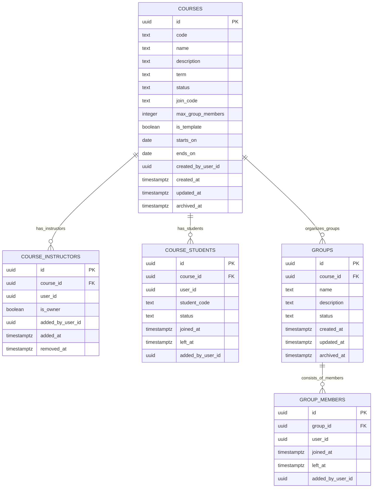

# Mô hình dữ liệu đề xuất — Classroom Service

**Trạng thái: Thiết kế mục tiêu, cần review.** Đây là bản đề xuất mô hình dữ liệu (ERD); chưa phải schema đã triển khai hoặc hợp đồng đã chốt.

Classroom Service chỉ dùng **khóa học** (`Course`) để quản lý cấu trúc học tập. Service sở hữu khóa học, giảng viên khóa học, sinh viên khóa học, nhóm và thành viên nhóm. Các ID thuộc service khác là tham chiếu logic, không tạo khóa ngoại xuyên database.

## Sơ đồ quan hệ thực thể (ERD)

## Bảng dữ liệu đề xuất

| Bảng                 | Thuộc tính đề xuất                                                                                                                                                                                                                                                                                            | Ràng buộc / ghi chú                                                                                                                                                                                                                                                                                                                                                                                                                                             |
| -------------------- | ------------------------------------------------------------------------------------------------------------------------------------------------------------------------------------------------------------------------------------------------------------------------------------------------------------- | --------------------------------------------------------------------------------------------------------------------------------------------------------------------------------------------------------------------------------------------------------------------------------------------------------------------------------------------------------------------------------------------------------------------------------------------------------------- |
| `courses`            | `id uuid`, `code text?`, `name text`, `description text?`, `term text?`, `status text`, `join_code text?`, `max_group_members integer?`, `is_template boolean`, `starts_on date?`, `ends_on date?`, `created_by_user_id uuid`, `created_at timestamptz`, `updated_at timestamptz`, `archived_at timestamptz?` | PK `id`; `created_by_user_id` tham chiếu logic Identity; unique `code` nếu mã khóa học là bắt buộc và duy nhất; CHECK `ends_on >= starts_on` khi cả hai trường có giá trị; unique `join_code` nếu dùng mã tham gia; CHECK `max_group_members > 0` nếu có giá trị; `is_template` (boolean yes/no, mặc định `false`) đánh dấu khóa học dùng làm template mẫu để copy snapshot cấu hình khi tạo khóa học mới (không lưu quan hệ hay khóa ngoại giữa các khóa học). |
| `course_instructors` | `id uuid`, `course_id uuid`, `user_id uuid`, `is_owner boolean`, `added_by_user_id uuid?`, `added_at timestamptz`, `removed_at timestamptz?`                                                                                                                                                                  | FK nội bộ `course_id → courses.id`; `user_id` và `added_by_user_id` tham chiếu logic Identity. Unique một quan hệ đang hoạt động trên (`course_id`, `user_id`); cần chốt quy tắc giảng viên chủ nhiệm/chủ khóa học.                                                                                                                                                                                                                                             |
| `course_students`    | `id uuid`, `course_id uuid`, `user_id uuid`, `student_code text?`, `status text`, `joined_at timestamptz`, `left_at timestamptz?`, `added_by_user_id uuid?`                                                                                                                                                   | FK nội bộ `course_id → courses.id`; `user_id` và `added_by_user_id` tham chiếu logic Identity. Bảng chứa danh sách sinh viên chính thức của khóa học. Unique một sinh viên đang hoạt động trên (`course_id`, `user_id`); lưu lịch sử khi rời hoặc thôi học (`left_at`).                                                                                                                                                                                         |
| `groups`             | `id uuid`, `course_id uuid`, `name text`, `description text?`, `status text`, `created_at timestamptz`, `updated_at timestamptz`, `archived_at timestamptz?`                                                                                                                                                  | FK `course_id → courses.id`; unique tên nhóm trong cùng khóa học nếu sản phẩm yêu cầu.                                                                                                                                                                                                                                                                                                                                                                          |
| `group_members`      | `id uuid`, `group_id uuid`, `user_id uuid`, `joined_at timestamptz`, `left_at timestamptz?`, `added_by_user_id uuid?`                                                                                                                                                                                         | FK `group_id → groups.id`; user ID là tham chiếu Identity. Unique một membership đang hoạt động trên (`group_id`, `user_id`). Ràng buộc: thành viên nhóm phải thuộc danh sách sinh viên đang hoạt động (`course_students`) của khóa học chứa nhóm đó; sĩ số nhóm không vượt quá `courses.max_group_members` (nếu có thiết lập).                                                                                                                                 |

## Quyết định cần review

- Quy tắc nhóm: một sinh viên có thể tham gia nhiều nhóm cùng một khóa học không, đổi nhóm ra sao, và có giữ lịch sử membership không?
- Xóa/lưu trữ khóa học, sinh viên khóa học và nhóm giữ lịch sử hay xóa vật lý?
- Cơ chế thêm sinh viên: Giảng viên thêm trực tiếp, import theo danh sách sinh viên hay sinh viên tự tham gia qua `join_code`?
- Các trường cấu hình được sao chép snapshot từ template: khi chọn một course template để tạo course mới, hệ thống copy snapshot các cấu hình hiện tại (như `description`, `max_group_members`...) vào bản ghi mới, hoàn toàn không phụ thuộc khóa ngoại.

Các bảng này thuộc `classroom_db`; chỉ `course_id` (trỏ đến `courses.id`) và `group_id` (trỏ đến `groups.id`) là khóa ngoại nội bộ. `user_id` và các ID thuộc service khác là tham chiếu logic. Xem thêm [quyền sở hữu dữ liệu](../system/data-ownership.md).
