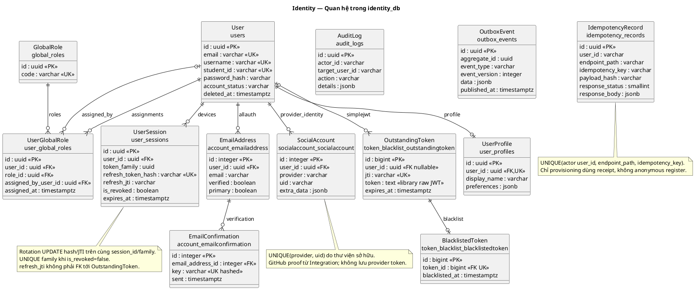

# Identity Service — schema hiện hành

Đối chiếu source ngày 2026-10-07. **Trạng thái: Một phần**: models/migrations và kiểm thử
local là nguồn đối chiếu; sơ đồ không xác nhận migration đã áp dụng trên mọi môi trường
hoặc đã nghiệm thu provider/Kafka/email/consumer liên dịch vụ.

Nguồn thực thi: [models.py](../../../apps/identity-service/accounts/models.py) và
[migrations](../../../apps/identity-service/accounts/migrations/).
Tham chiếu: [Identity API](../../architecture/Identity_Service_API_Specification.md),
[quyền sở hữu dữ liệu](../../system/data-ownership.md),
[hướng dẫn Identity](../../identity-service/README.md#trach-nhiem-va-du-lieu).

## 1. Quyền sở hữu và tên bảng

Identity sở hữu `identity_db`. Các FK trong sơ đồ chỉ nằm trong database này.
Classroom/Project chỉ tham chiếu UUID user hoặc dùng projection/API; không tạo FK
xuyên service. Global STUDENT/TEACHER/SYSTEM_ADMIN không thay thế quyền trên lớp/project.
Integration là nơi duy nhất gọi GitHub API.

Có 8 bảng nghiệp vụ do UTask khai báo và 19 bảng framework/thư viện (kể cả migrations).
Model Python dùng PascalCase; bảng nghiệp vụ dùng snake_case số nhiều qua `db_table`.
Các bảng thư viện giữ tên mặc định `<app_label>_<model lowercase>` để tương thích migrations.

| Model | Bảng | Trách nhiệm |
| --- | --- | --- |
| User | users | Tài khoản và vòng đời |
| UserProfile | user_profiles | Hồ sơ một-một |
| GlobalRole | global_roles | Danh mục vai trò toàn cục |
| UserGlobalRole | user_global_roles | Gán vai trò, người gán và thời điểm |
| UserSession | user_sessions | Thiết bị, refresh family và thu hồi |
| AuditLog | audit_logs | Nhật ký append-only |
| OutboxEvent | outbox_events | Event ghi cùng transaction nghiệp vụ |
| IdempotencyRecord | idempotency_records | Receipt provisioning chống xử lý trùng |

## 2. Quan hệ hiện hành

Hình thể hiện8 bảng nghiệp vụ và5 bảng thư viện liên quan trực tiếp đến danh tính/JWT.
Các bảng framework còn lại ở mục4; trường trong hình là khóa/dữ liệu chính, không thay
models hoặc toàn bộ data dictionary.

Nguồn PlantUML

Audit actor/target và outbox aggregate là ID logic, không phải FK. `IdempotencyRecord.user_id`
là ID actor gọi provisioning. UserProfile có UNIQUE user_id; manager/registration tạo hồ sơ
cùng giao dịch, nhưng riêng FK không buộc mọi user phải có profile.

## 3. Dữ liệu và ràng buộc nghiệp vụ

| Bảng | Trường và quy tắc chính |
| --- | --- |
| users | UUID id; email/username unique và lower(trim); student_id nullable, unique khi non-null và upper(trim). Trạng thái chỉ PENDING_ACTIVATION/ACTIVE/SUSPENDED. password Python ánh xạ password_hash DB; last_login ánh xạ last_login_at. last_login_ip, created_at, updated_at, deleted_at được giữ. is_active tính từ ACTIVE và chưa xóa. |
| user_profiles | UUID id, UNIQUE user_id; first_name, last_name, display_name; avatar_url, phone_number, bio, github_username, academic_year, faculty, timezone, preferences JSONB, created_at/updated_at. Trigger cập nhật display_name khi tên đổi. Index lower(github_username) khi non-null. |
| global_roles | UUID id; code unique, CHECK SYSTEM_ADMIN/TEACHER/STUDENT; name, description, created_at. Seed bằng migration/command, không tự nâng quyền bằng Django staff. |
| user_global_roles | UUID id; FK user CASCADE, role RESTRICT, assigned_by_user nullable SET NULL; assigned_at. UNIQUE(user_id, role_id), index role_id. |
| user_sessions | UUID id; FK user CASCADE; family UUID ổn định, refresh hash SHA-256 unique, refresh_jti nullable trỏ logic tới SimpleJWT. is_revoked/revoked_at/revoked_reason nhất quán; ip_address, user_agent, device_name, expires_at, created_at. UNIQUE family khi chưa revoked; expires_at > created_at; index user/is_revoked/expires_at và family. |
| audit_logs | UUID id; actor_id/target_user_id nullable VARCHAR(100), action VARCHAR(60), ip_address, user_agent, details JSONB, created_at. Trigger cấm UPDATE/DELETE. Index thời gian, actor, target và action. |
| outbox_events | UUID id/aggregate_id; event_type, event_version, data JSONB chứa event envelope, created_at, published_at, retry_count, last_error. Partial index created_at khi published_at NULL. Chỉ đánh dấu published sau Kafka ACK; publisher chưa nghiệm thu. |
| idempotency_records | UUID id; actor user_id VARCHAR(100), endpoint_path, idempotency_key, payload_hash, response_status, response_body JSONB, created_at. UNIQUE(actor/path/key), index created_at; không lưu secret trong receipt. |

MVP xóa mềm; email/username/MSSV vẫn được reserved. Admin restore không phục hồi phiên cũ.
Không có SQL DDL thay thế migrations trong tài liệu này. Trigger thật duy nhất của nghiệp vụ
là tạo display_name (0001) và bảo vệ audit (0002).

## 4. Bảng do thư viện sở hữu

| Thư viện | Bảng | Chính sách |
| --- | --- | --- |
| allauth account | account_emailaddress, account_emailconfirmation | EmailAddress.verified của email hiện tại là nguồn chuẩn. Response is_email_verified là property, không còn cột lặp. Confirmation key được hash qua adapter; expire 7 ngày, consume bằng xóa key. |
| allauth social | socialaccount_socialaccount, socialaccount_socialapp, socialaccount_socialapp_sites, socialaccount_socialtoken | SocialAccount giữ provider/uid/extra_data; Google qua allauth, GitHub chỉ nhận proof Integration. STORE_TOKENS=False: SocialToken không được dùng lưu provider token dù bảng tồn tại. |
| Axes | axes_accessattempt, axes_accessattemptexpiration, axes_accessfailurelog, axes_accesslog | Library handler quản lý 5 lần sai/15 phút. Email/username quy về UUID; lockout user/IP riêng, không đổi account_status, không thu hồi phiên đang hoạt động. |
| SimpleJWT | token_blacklist_outstandingtoken, token_blacklist_blacklistedtoken | Thư viện tạo/rotate/blacklist refresh. OutstandingToken lưu raw refresh theo thư viện; chỉ user_sessions giữ hash. |
| Django | auth_group, auth_group_permissions, auth_permission, django_content_type, django_migrations, django_session, django_site | Metadata/quyền/session/site framework. User là accounts.User/users, không có auth_user thứ hai. Django Group không thay GlobalRole. |

Không có bảng oauth_accounts, password_reset_tokens hay account_activation_tokens riêng.
Reset dùng generator allauth/Django, timeout 900s; thay password vô hiệu token cũ.

## 5. Phiên và giới hạn bảo mật

Một thiết bị giữ một UserSession; rotation cập nhật hash/jti dưới user lock, không tạo row
session mới. SimpleJWT quản lý rotation/blacklist. Family có hạn tuyệt đối 7 ngày.
Replay refresh còn hạn thu hồi family và ghi audit trước khi trả lỗi; concurrent refresh
cùng token có một success, một replay và family bị thu hồi theo API.

Identity kiểm live session khi xác thực access nên thu hồi có hiệu lực tại Identity.
Consumer chỉ kiểm chữ ký JWT chưa tự có revocation tức thì; cần session-status và acceptance
liên dịch vụ. Không coi blacklist refresh là thu hồi access ở mọi service.
Mail secret được mã hóa bằng key cấu hình riêng; không log password/token/cookie.

## 6. Trạng thái schema và giới hạn

Migrations là nguồn thực thi, không sửa migration đã áp dụng hoặc chạy DDL từ tài liệu.
Trạng thái DB cụ thể cần kiểm bằng `manage.py showmigrations`; ERD không chứng minh
migration đã được áp dụng trên máy đó. Data migration không đảo ngược tự động cần được
xem xét trước vận hành.

Reset dùng uid/token của generator, không token row/used_at; confirmation do allauth
quản lý. User không có trạng thái LOCKED hoặc counter lockout tự viết. JWT một khóa
RS256 không kid; chưa có key rotation overlap. Outbox chỉ được ghi, chưa có publisher/
ACK/retention worker trong Identity. Provider/Kafka/email/consumer thật cần nghiệm thu
riêng; quan hệ thư viện trong hình không chứng minh tích hợp E2E.
