# Identity Service — Sequence hiện hành

Đối chiếu source ngày 2026-10-07. **Trạng thái: Một phần**: phần Identity có implementation;
provider/consumer/runtime liên service cần nghiệm thu riêng.

[Chỉ mục](README.md) · [Use case](usecase.md) · [ERD](erd.md) ·
[API](../../architecture/Identity_Service_API_Specification.md) ·
[Kiểm thử](../../architecture/Identity_Service_Test_Specification.md)

## 1. Quy ước

- Nhãn route trong hình bỏ `/api/v1`; request/response đầy đủ ở use case và OpenAPI.
- TX-I chỉ một `transaction.atomic()` của Identity; nested atomic là savepoint, không
  distributed transaction. Khóa user trước session; writers nhiều user dùng thứ tự UUID.
- Provider OAuth/R2 ngoài row-lock transaction; Google account/link và token issuance có
  các transaction riêng. Sơ đồ không bổ sung atomicity mà code không có.
- Django/allauth quản lý password/reset/confirmation; SimpleJWT quản lý chữ ký,
  rotation/blacklist; Axes quản lý counter. UserSession chỉ metadata, hash/JTI/family.
- Refresh JWT cũ còn hạn dùng lại: revoke/audit phải commit trước401. JWT hết hạn được
  thư viện từ chối trước replay. Không hàng child/ROTATED được tạo khi refresh.
- Response dùng common renderer/exception handler; details là mảng, giữ auth/retry headers.
  JWKS `keys` ở root. Login refresh body rỗng; refresh JWT trong cookie Secure/HttpOnly/Lax.
- Mutation dùng refresh cookie kiểm CSRF/Origin; Bearer không tự thay kiểm quyền tài nguyên.
- Dotted paths và hooks thật nằm trong config/settings.py. OAuth/avatar chỉ có route khi
  flag bật; backend GitHub mapping luôn có. HTTP queued không chứng minh mail delivery.

## 2. Danh mục

| Sequence | Nội dung | Source thực thi |
| --- | --- | --- |
| [SQ-ID-01](#sq-id-01) | Đăng ký Student pending | [authentication/views/registration.py](../../../apps/identity-service/authentication/views/registration.py) |
| [SQ-ID-02](#sq-id-02) | Login bằng Django Auth và Axes | [authentication/serializers/auth.py](../../../apps/identity-service/authentication/serializers/auth.py) |
| [SQ-ID-03](#sq-id-03) | Refresh JWT trên session ổn định | [authentication/services/session_service.py](../../../apps/identity-service/authentication/services/session_service.py) |
| [SQ-ID-04](#sq-id-04) | Kiểm tra phiên và boundary quyền tài nguyên | [authentication/views/internal.py](../../../apps/identity-service/authentication/views/internal.py) |
| [SQ-ID-05](#sq-id-05) | Logout hiện tại, tất cả và thiết bị từ xa | [authentication/views/devices.py](../../../apps/identity-service/authentication/views/devices.py) |
| [SQ-ID-06](#sq-id-06) | Yêu cầu reset qua form thư viện và outbox | [authentication/services/password_service.py](../../../apps/identity-service/authentication/services/password_service.py) |
| [SQ-ID-07](#sq-id-07) | Reset confirm bằng generator và SetPasswordForm | [authentication/services/password_service.py](../../../apps/identity-service/authentication/services/password_service.py) |
| [SQ-ID-08](#sq-id-08) | Đổi password và thu hồi mọi phiên | [authentication/services/password_service.py](../../../apps/identity-service/authentication/services/password_service.py) |
| [SQ-ID-09](#sq-id-09) | Xác minh email và kích hoạt, sau đó login riêng | [accounts/services/registration.py](../../../apps/identity-service/accounts/services/registration.py) |
| [SQ-ID-10](#sq-id-10) | Import/enrollment — thiết kế mục tiêu ngoài Identity | [accounts/services/provisioning.py](../../../apps/identity-service/accounts/services/provisioning.py) |
| [SQ-ID-11](#sq-id-11) | Provisioning: receipt và ordered locks | [accounts/services/provisioning.py](../../../apps/identity-service/accounts/services/provisioning.py) |
| [SQ-ID-12](#sq-id-12) | Resend activation nội bộ cho Classroom | [accounts/services/provisioning.py](../../../apps/identity-service/accounts/services/provisioning.py) |
| [SQ-ID-13](#sq-id-13) | Google OAuth: context, allauth và các transaction riêng | [accounts/services/oauth_accounts.py](../../../apps/identity-service/accounts/services/oauth_accounts.py) |
| [SQ-ID-14](#sq-id-14) | GitHub qua Integration và OAuth unlink | [accounts/services/oauth_accounts.py](../../../apps/identity-service/accounts/services/oauth_accounts.py) |
| [SQ-ID-15](#sq-id-15) | PATCH hồ sơ: chỉ mutation thật mới phát event | [accounts/services/profiles.py](../../../apps/identity-service/accounts/services/profiles.py) |
| [SQ-ID-16](#sq-id-16) | Avatar receipt bound user và session | [accounts/services/avatars.py](../../../apps/identity-service/accounts/services/avatars.py) |
| [SQ-ID-17](#sq-id-17) | Admin status/restore: mọi mutation thu hồi phiên | [accounts/services/administration.py](../../../apps/identity-service/accounts/services/administration.py) |
| [SQ-ID-18](#sq-id-18) | Admin role và revoke credential | [accounts/services/administration.py](../../../apps/identity-service/accounts/services/administration.py) |
| [SQ-ID-19](#sq-id-19) | Ghi outbox hiện hành và handoff mục tiêu | [messaging/outbox.py](../../../apps/identity-service/messaging/outbox.py) |
| [SQ-ID-20](#sq-id-20) | JWKS một khóa RS256 hiện hành | [authentication/adapters/session_tokens.py](../../../apps/identity-service/authentication/adapters/session_tokens.py) |
| [SQ-ID-21](#sq-id-21) | Đọc hồ sơ, batch, sessions và admin list | [accounts/views/profiles.py](../../../apps/identity-service/accounts/views/profiles.py) |
| [SQ-ID-22](#sq-id-22) | Resend activation public | [authentication/views/registration.py](../../../apps/identity-service/authentication/views/registration.py) |
| [SQ-ID-23](#sq-id-23) | GitHub mapping nội bộ cho reconciliation | [accounts/views/internal.py](../../../apps/identity-service/accounts/views/internal.py) |

## SQ-ID-01 — Đăng ký Student pending

Nguồn: [authentication/views/registration.py](../../../apps/identity-service/authentication/views/registration.py);
kiểm thử: [test_registration.py](../../../apps/identity-service/tests/test_registration.py).

Nguồn PlantUML

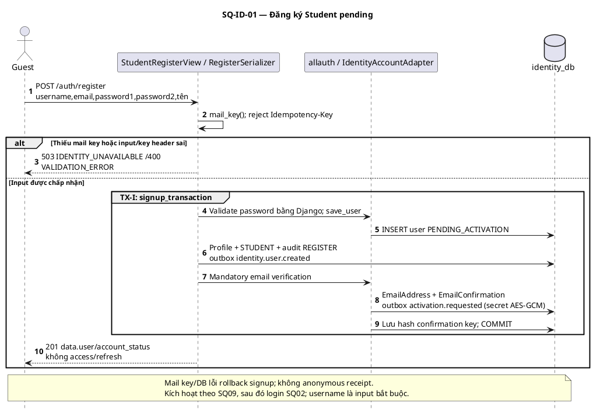
```plantuml
@startuml SQ-ID-01
skinparam defaultFontName Arial
skinparam shadowing false
skinparam sequenceMessageAlign left
skinparam responseMessageBelowArrow true
skinparam maxMessageSize 300
hide footbox
autonumber
title SQ-ID-01 — Đăng ký Student pending
actor "Guest" as U
participant "StudentRegisterView / RegisterSerializer" as V
participant "allauth / IdentityAccountAdapter" as A
database "identity_db" as D
U -> V : POST /auth/register\nusername,email,password1,password2,tên
V -> V : mail_key(); reject Idempotency-Key
alt Thiếu mail key hoặc input/key header sai
 V --> U : 503 IDENTITY_UNAVAILABLE /400 VALIDATION_ERROR
else Input được chấp nhận
 group TX-I: signup_transaction
  V -> A : Validate password bằng Django; save_user
  A -> D : INSERT user PENDING_ACTIVATION
  V -> D : Profile + STUDENT + audit REGISTER\noutbox identity.user.created
  V -> A : Mandatory email verification
  A -> D : EmailAddress + EmailConfirmation\noutbox activation.requested (secret AES-GCM)
  A -> D : Lưu hash confirmation key; COMMIT
 end
 V --> U : 201 data.user/account_status\nkhông access/refresh
end
note over U,D : Mail key/DB lỗi rollback signup; không anonymous receipt.\nKích hoạt theo SQ09, sau đó login SQ02; username là input bắt buộc.
@enduml
```

## SQ-ID-02 — Login bằng Django Auth và Axes

Nguồn: [authentication/serializers/auth.py](../../../apps/identity-service/authentication/serializers/auth.py);
kiểm thử: [test_login.py](../../../apps/identity-service/tests/test_login.py).

Nguồn PlantUML

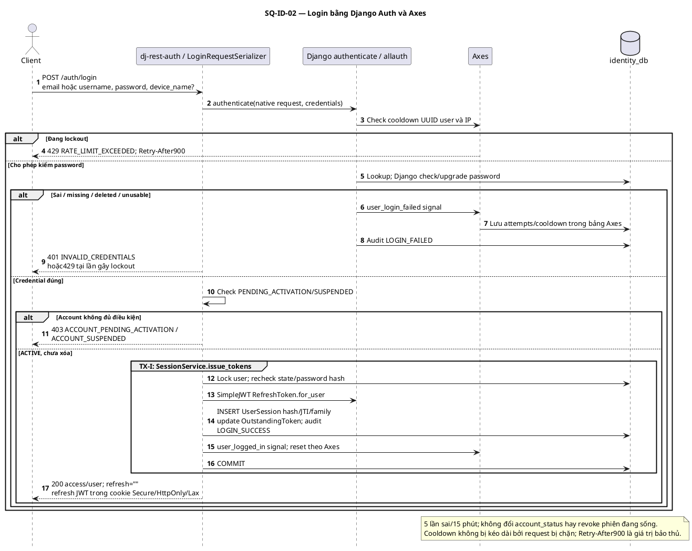
```plantuml
@startuml SQ-ID-02
skinparam defaultFontName Arial
skinparam shadowing false
skinparam sequenceMessageAlign left
skinparam responseMessageBelowArrow true
skinparam maxMessageSize 300
hide footbox
autonumber
title SQ-ID-02 — Login bằng Django Auth và Axes
actor "Client" as U
participant "dj-rest-auth / LoginRequestSerializer" as V
participant "Django authenticate / allauth" as A
participant "Axes" as X
database "identity_db" as D
U -> V : POST /auth/login\nemail hoặc username, password, device_name?
V -> A : authenticate(native request, credentials)
A -> X : Check cooldown UUID user và IP
alt Đang lockout
 X --> U : 429 RATE_LIMIT_EXCEEDED; Retry-After900
else Cho phép kiểm password
 A -> D : Lookup; Django check/upgrade password
 alt Sai / missing / deleted / unusable
  A -> X : user_login_failed signal
  X -> D : Lưu attempts/cooldown trong bảng Axes
  A -> D : Audit LOGIN_FAILED
  V --> U : 401 INVALID_CREDENTIALS\nhoặc429 tại lần gây lockout
 else Credential đúng
  V -> V : Check PENDING_ACTIVATION/SUSPENDED
  alt Account không đủ điều kiện
   V --> U : 403 ACCOUNT_PENDING_ACTIVATION / ACCOUNT_SUSPENDED
  else ACTIVE, chưa xóa
   group TX-I: SessionService.issue_tokens
    V -> D : Lock user; recheck state/password hash
    V -> A : SimpleJWT RefreshToken.for_user
    V -> D : INSERT UserSession hash/JTI/family\nupdate OutstandingToken; audit LOGIN_SUCCESS
    V -> X : user_logged_in signal; reset theo Axes
    V -> D : COMMIT
   end
   V --> U : 200 access/user; refresh=""\nrefresh JWT trong cookie Secure/HttpOnly/Lax
  end
 end
end
note over X,D : 5 lần sai/15 phút; không đổi account_status hay revoke phiên đang sống.\nCooldown không bị kéo dài bởi request bị chặn; Retry-After900 là giá trị bảo thủ.
@enduml
```

## SQ-ID-03 — Refresh JWT trên session ổn định

Nguồn: [authentication/services/session_service.py](../../../apps/identity-service/authentication/services/session_service.py);
kiểm thử: [test_rotation.py](../../../apps/identity-service/tests/test_rotation.py).

Nguồn PlantUML

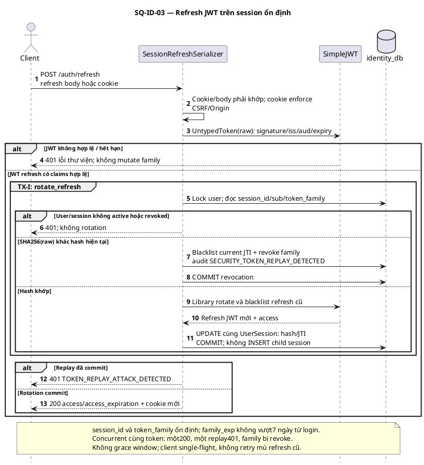
```plantuml
@startuml SQ-ID-03
skinparam defaultFontName Arial
skinparam shadowing false
skinparam sequenceMessageAlign left
skinparam responseMessageBelowArrow true
skinparam maxMessageSize 300
hide footbox
autonumber
title SQ-ID-03 — Refresh JWT trên session ổn định
actor "Client" as U
participant "SessionRefreshSerializer" as V
participant "SimpleJWT" as J
database "identity_db" as D
U -> V : POST /auth/refresh\nrefresh body hoặc cookie
V -> V : Cookie/body phải khớp; cookie enforce CSRF/Origin
V -> J : UntypedToken(raw): signature/iss/aud/expiry
alt JWT không hợp lệ / hết hạn
 J --> U : 401 lỗi thư viện; không mutate family
else JWT refresh có claims hợp lệ
 group TX-I: rotate_refresh
  V -> D : Lock user; đọc session_id/sub/token_family
  alt User/session không active hoặc revoked
   V --> U : 401; không rotation
  else SHA256(raw) khác hash hiện tại
   V -> D : Blacklist current JTI + revoke family\naudit SECURITY_TOKEN_REPLAY_DETECTED
   V -> D : COMMIT revocation
  else Hash khớp
   V -> J : Library rotate và blacklist refresh cũ
   J --> V : Refresh JWT mới + access
   V -> D : UPDATE cùng UserSession: hash/JTI\nCOMMIT; không INSERT child session
  end
 end
 alt Replay đã commit
  V --> U : 401 TOKEN_REPLAY_ATTACK_DETECTED
 else Rotation commit
  V --> U : 200 access/access_expiration + cookie mới
 end
end
note over U,D : session_id và token_family ổn định; family_exp không vượt7 ngày từ login.\nConcurrent cùng token: một200, một replay401, family bị revoke.\nKhông grace window; client single-flight, không retry mù refresh cũ.
@enduml
```

## SQ-ID-04 — Kiểm tra phiên và boundary quyền tài nguyên

Nguồn: [authentication/views/internal.py](../../../apps/identity-service/authentication/views/internal.py);
kiểm thử: [test_api_completion.py](../../../apps/identity-service/tests/test_api_completion.py).

Nguồn PlantUML

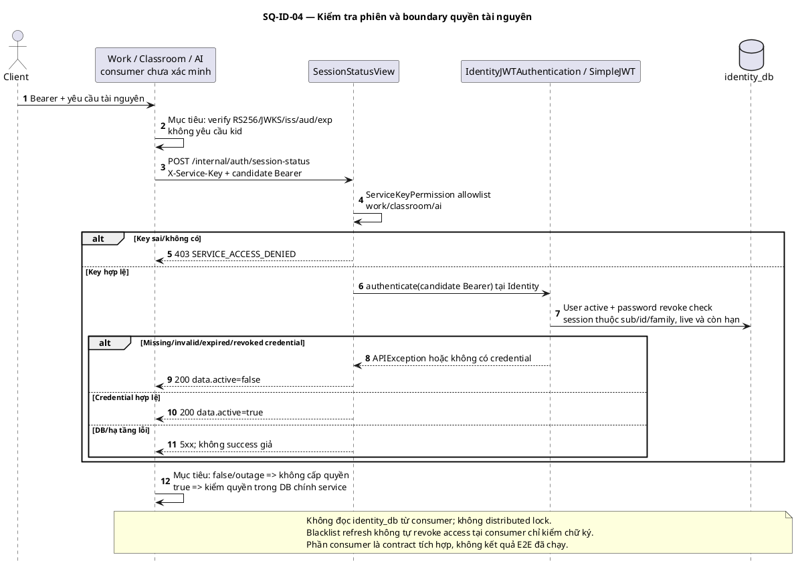
```plantuml
@startuml SQ-ID-04
skinparam defaultFontName Arial
skinparam shadowing false
skinparam sequenceMessageAlign left
skinparam responseMessageBelowArrow true
skinparam maxMessageSize 300
hide footbox
autonumber
title SQ-ID-04 — Kiểm tra phiên và boundary quyền tài nguyên
actor "Client" as U
participant "Work / Classroom / AI\nconsumer chưa xác minh" as S
participant "SessionStatusView" as I
participant "IdentityJWTAuthentication / SimpleJWT" as A
database "identity_db" as D
U -> S : Bearer + yêu cầu tài nguyên
S -> S : Mục tiêu: verify RS256/JWKS/iss/aud/exp\nkhông yêu cầu kid
S -> I : POST /internal/auth/session-status\nX-Service-Key + candidate Bearer
I -> I : ServiceKeyPermission allowlist work/classroom/ai
alt Key sai/không có
 I --> S : 403 SERVICE_ACCESS_DENIED
else Key hợp lệ
 I -> A : authenticate(candidate Bearer) tại Identity
 A -> D : User active + password revoke check\nsession thuộc sub/id/family, live và còn hạn
 alt Missing/invalid/expired/revoked credential
  A --> I : APIException hoặc không có credential
  I --> S : 200 data.active=false
 else Credential hợp lệ
  I --> S : 200 data.active=true
 else DB/hạ tầng lỗi
  I --> S : 5xx; không success giả
 end
end
S -> S : Mục tiêu: false/outage => không cấp quyền\ntrue => kiểm quyền trong DB chính service
note over S,D : Không đọc identity_db từ consumer; không distributed lock.\nBlacklist refresh không tự revoke access tại consumer chỉ kiểm chữ ký.\nPhần consumer là contract tích hợp, không kết quả E2E đã chạy.
@enduml
```

## SQ-ID-05 — Logout hiện tại, tất cả và thiết bị từ xa

Nguồn: [authentication/views/devices.py](../../../apps/identity-service/authentication/views/devices.py);
kiểm thử: [test_devices.py](../../../apps/identity-service/tests/test_devices.py).

Nguồn PlantUML

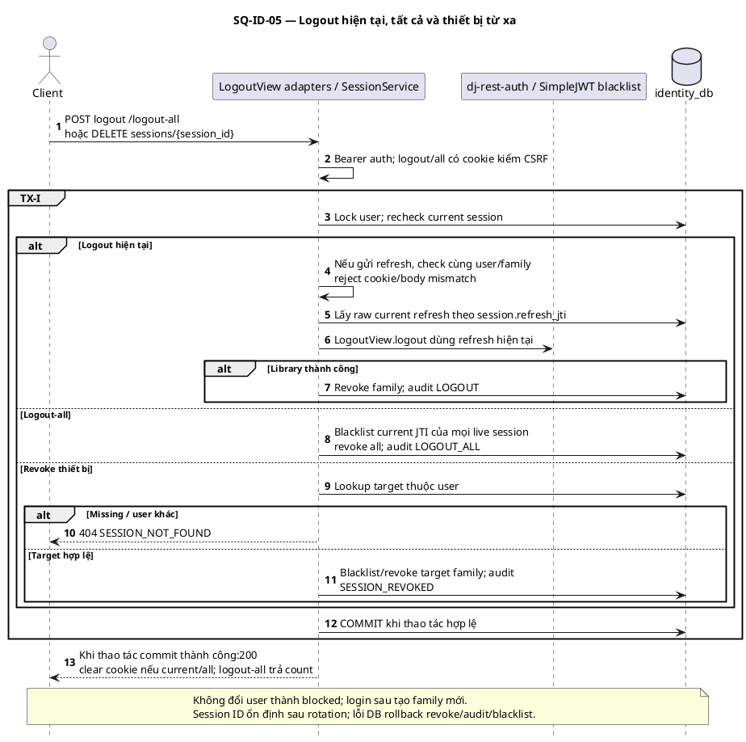
```plantuml
@startuml SQ-ID-05
skinparam defaultFontName Arial
skinparam shadowing false
skinparam sequenceMessageAlign left
skinparam responseMessageBelowArrow true
skinparam maxMessageSize 300
hide footbox
autonumber
title SQ-ID-05 — Logout hiện tại, tất cả và thiết bị từ xa
actor "Client" as U
participant "LogoutView adapters / SessionService" as V
participant "dj-rest-auth / SimpleJWT blacklist" as L
database "identity_db" as D
U -> V : POST logout /logout-all\nhoặc DELETE sessions/{session_id}
V -> V : Bearer auth; logout/all có cookie kiểm CSRF
group TX-I
 V -> D : Lock user; recheck current session
 alt Logout hiện tại
  V -> V : Nếu gửi refresh, check cùng user/family\nreject cookie/body mismatch
  V -> D : Lấy raw current refresh theo session.refresh_jti
  V -> L : LogoutView.logout dùng refresh hiện tại
  alt Library thành công
   V -> D : Revoke family; audit LOGOUT
  end
 else Logout-all
  V -> D : Blacklist current JTI của mọi live session\nrevoke all; audit LOGOUT_ALL
 else Revoke thiết bị
  V -> D : Lookup target thuộc user
  alt Missing / user khác
   V --> U : 404 SESSION_NOT_FOUND
  else Target hợp lệ
   V -> D : Blacklist/revoke target family; audit SESSION_REVOKED
  end
 end
 V -> D : COMMIT khi thao tác hợp lệ
end
 V --> U : Khi thao tác commit thành công:200\nclear cookie nếu current/all; logout-all trả count
note over U,D : Không đổi user thành blocked; login sau tạo family mới.\nSession ID ổn định sau rotation; lỗi DB rollback revoke/audit/blacklist.
@enduml
```

## SQ-ID-06 — Yêu cầu reset qua form thư viện và outbox

Nguồn: [authentication/services/password_service.py](../../../apps/identity-service/authentication/services/password_service.py);
kiểm thử: [test_password_errors.py](../../../apps/identity-service/tests/test_password_errors.py).

Nguồn PlantUML

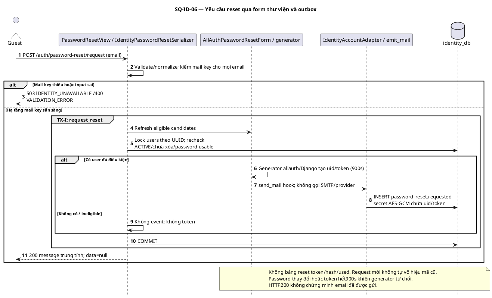
```plantuml
@startuml SQ-ID-06
skinparam defaultFontName Arial
skinparam shadowing false
skinparam sequenceMessageAlign left
skinparam responseMessageBelowArrow true
skinparam maxMessageSize 300
hide footbox
autonumber
title SQ-ID-06 — Yêu cầu reset qua form thư viện và outbox
actor "Guest" as U
participant "PasswordResetView / IdentityPasswordResetSerializer" as V
participant "AllAuthPasswordResetForm / generator" as F
participant "IdentityAccountAdapter / emit_mail" as M
database "identity_db" as D
U -> V : POST /auth/password-reset/request (email)
V -> V : Validate/normalize; kiểm mail key cho mọi email
alt Mail key thiếu hoặc input sai
 V --> U : 503 IDENTITY_UNAVAILABLE /400 VALIDATION_ERROR
else Hạ tầng mail key sẵn sàng
 group TX-I: request_reset
  V -> F : Refresh eligible candidates
  V -> D : Lock users theo UUID; recheck\nACTIVE/chưa xóa/password usable
  alt Có user đủ điều kiện
   F -> F : Generator allauth/Django tạo uid/token (900s)
   F -> M : send_mail hook; không gọi SMTP/provider
   M -> D : INSERT password_reset.requested\nsecret AES-GCM chứa uid/token
  else Không có / ineligible
   V -> V : Không event; không token
  end
  V -> D : COMMIT
 end
 V --> U : 200 message trung tính; data=null
end
note over F,D : Không bảng reset token/hash/used. Request mới không tự vô hiệu mã cũ.\nPassword thay đổi hoặc token hết900s khiến generator từ chối.\nHTTP200 không chứng minh email đã được gửi.
@enduml
```

## SQ-ID-07 — Reset confirm bằng generator và SetPasswordForm

Nguồn: [authentication/services/password_service.py](../../../apps/identity-service/authentication/services/password_service.py);
kiểm thử: [test_password_errors.py](../../../apps/identity-service/tests/test_password_errors.py).

Nguồn PlantUML

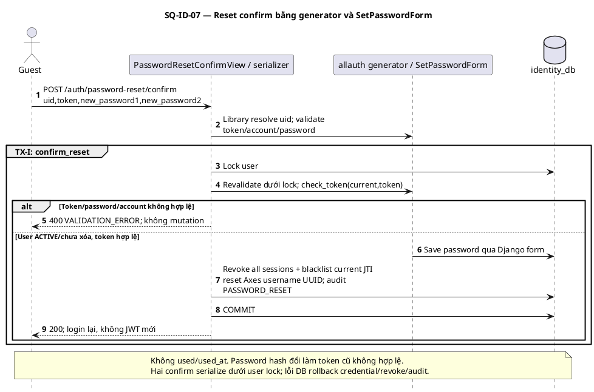
```plantuml
@startuml SQ-ID-07
skinparam defaultFontName Arial
skinparam shadowing false
skinparam sequenceMessageAlign left
skinparam responseMessageBelowArrow true
skinparam maxMessageSize 300
hide footbox
autonumber
title SQ-ID-07 — Reset confirm bằng generator và SetPasswordForm
actor "Guest" as U
participant "PasswordResetConfirmView / serializer" as V
participant "allauth generator / SetPasswordForm" as F
database "identity_db" as D
U -> V : POST /auth/password-reset/confirm\nuid,token,new_password1,new_password2
V -> F : Library resolve uid; validate token/account/password
group TX-I: confirm_reset
 V -> D : Lock user
 V -> F : Revalidate dưới lock; check_token(current,token)
 alt Token/password/account không hợp lệ
  V --> U : 400 VALIDATION_ERROR; không mutation
 else User ACTIVE/chưa xóa, token hợp lệ
  F -> D : Save password qua Django form
  V -> D : Revoke all sessions + blacklist current JTI\nreset Axes username UUID; audit PASSWORD_RESET
  V -> D : COMMIT
  V --> U : 200; login lại, không JWT mới
 end
end
note over U,D : Không used/used_at. Password hash đổi làm token cũ không hợp lệ.\nHai confirm serialize dưới user lock; lỗi DB rollback credential/revoke/audit.
@enduml
```

## SQ-ID-08 — Đổi password và thu hồi mọi phiên

Nguồn: [authentication/services/password_service.py](../../../apps/identity-service/authentication/services/password_service.py);
kiểm thử: [test_flows.py](../../../apps/identity-service/tests/test_flows.py).

Nguồn PlantUML

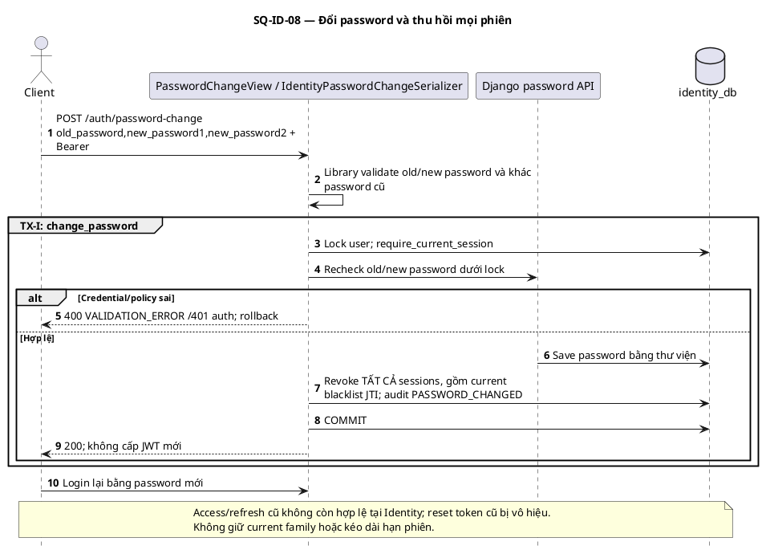
```plantuml
@startuml SQ-ID-08
skinparam defaultFontName Arial
skinparam shadowing false
skinparam sequenceMessageAlign left
skinparam responseMessageBelowArrow true
skinparam maxMessageSize 300
hide footbox
autonumber
title SQ-ID-08 — Đổi password và thu hồi mọi phiên
actor "Client" as U
participant "PasswordChangeView / IdentityPasswordChangeSerializer" as V
participant "Django password API" as F
database "identity_db" as D
U -> V : POST /auth/password-change\nold_password,new_password1,new_password2 + Bearer
V -> V : Library validate old/new password và khác password cũ
group TX-I: change_password
 V -> D : Lock user; require_current_session
 V -> F : Recheck old/new password dưới lock
 alt Credential/policy sai
  V --> U : 400 VALIDATION_ERROR /401 auth; rollback
 else Hợp lệ
  F -> D : Save password bằng thư viện
  V -> D : Revoke TẤT CẢ sessions, gồm current\nblacklist JTI; audit PASSWORD_CHANGED
  V -> D : COMMIT
  V --> U : 200; không cấp JWT mới
 end
end
U -> V : Login lại bằng password mới
note over U,D : Access/refresh cũ không còn hợp lệ tại Identity; reset token cũ bị vô hiệu.\nKhông giữ current family hoặc kéo dài hạn phiên.
@enduml
```

## SQ-ID-09 — Xác minh email và kích hoạt, sau đó login riêng

Nguồn: [accounts/services/registration.py](../../../apps/identity-service/accounts/services/registration.py);
kiểm thử: [test_flows.py](../../../apps/identity-service/tests/test_flows.py).

Nguồn PlantUML

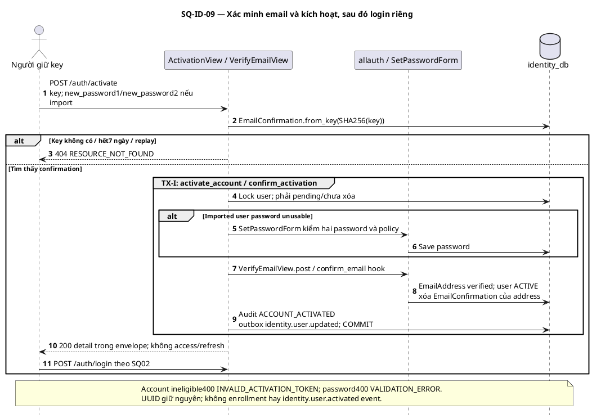
```plantuml
@startuml SQ-ID-09
skinparam defaultFontName Arial
skinparam shadowing false
skinparam sequenceMessageAlign left
skinparam responseMessageBelowArrow true
skinparam maxMessageSize 300
hide footbox
autonumber
title SQ-ID-09 — Xác minh email và kích hoạt, sau đó login riêng
actor "Người giữ key" as U
participant "ActivationView / VerifyEmailView" as V
participant "allauth / SetPasswordForm" as A
database "identity_db" as D
U -> V : POST /auth/activate\nkey; new_password1/new_password2 nếu import
V -> D : EmailConfirmation.from_key(SHA256(key))
alt Key không có / hết7 ngày / replay
 V --> U : 404 RESOURCE_NOT_FOUND
else Tìm thấy confirmation
 group TX-I: activate_account / confirm_activation
  V -> D : Lock user; phải pending/chưa xóa
  alt Imported user password unusable
   V -> A : SetPasswordForm kiểm hai password và policy
   A -> D : Save password
  end
  V -> A : VerifyEmailView.post / confirm_email hook
  A -> D : EmailAddress verified; user ACTIVE\nxóa EmailConfirmation của address
  V -> D : Audit ACCOUNT_ACTIVATED\noutbox identity.user.updated; COMMIT
 end
 V --> U : 200 detail trong envelope; không access/refresh
 U -> V : POST /auth/login theo SQ02
end
note over U,D : Account ineligible400 INVALID_ACTIVATION_TOKEN; password400 VALIDATION_ERROR.\nUUID giữ nguyên; không enrollment hay identity.user.activated event.
@enduml
```

## SQ-ID-10 — Import/enrollment — thiết kế mục tiêu ngoài Identity

Nguồn: [accounts/services/provisioning.py](../../../apps/identity-service/accounts/services/provisioning.py);
kiểm thử: [test_provisioning.py](../../../apps/identity-service/tests/test_provisioning.py).

Nguồn PlantUML

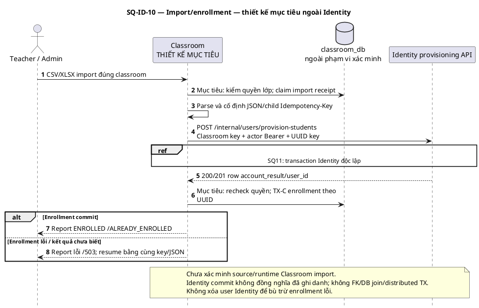
```plantuml
@startuml SQ-ID-10
skinparam defaultFontName Arial
skinparam shadowing false
skinparam sequenceMessageAlign left
skinparam responseMessageBelowArrow true
skinparam maxMessageSize 300
hide footbox
autonumber
title SQ-ID-10 — Import/enrollment — thiết kế mục tiêu ngoài Identity
actor "Teacher / Admin" as U
participant "Classroom\nTHIẾT KẾ MỤC TIÊU" as C
database "classroom_db\nngoài phạm vi xác minh" as CD
participant "Identity provisioning API" as I
U -> C : CSV/XLSX import đúng classroom
C -> CD : Mục tiêu: kiểm quyền lớp; claim import receipt
C -> C : Parse và cố định JSON/child Idempotency-Key
C -> I : POST /internal/users/provision-students\nClassroom key + actor Bearer + UUID key
ref over C,I : SQ11: transaction Identity độc lập
I --> C : 200/201 row account_result/user_id
C -> CD : Mục tiêu: recheck quyền; TX-C enrollment theo UUID
alt Enrollment commit
 C --> U : Report ENROLLED /ALREADY_ENROLLED
else Enrollment lỗi / kết quả chưa biết
 C --> U : Report lỗi /503; resume bằng cùng key/JSON
end
note over C,I : Chưa xác minh source/runtime Classroom import.\nIdentity commit không đồng nghĩa đã ghi danh; không FK/DB join/distributed TX.\nKhông xóa user Identity để bù trừ enrollment lỗi.
@enduml
```

## SQ-ID-11 — Provisioning: receipt và ordered locks

Nguồn: [accounts/services/provisioning.py](../../../apps/identity-service/accounts/services/provisioning.py);
kiểm thử: [test_provisioning.py](../../../apps/identity-service/tests/test_provisioning.py).

Nguồn PlantUML

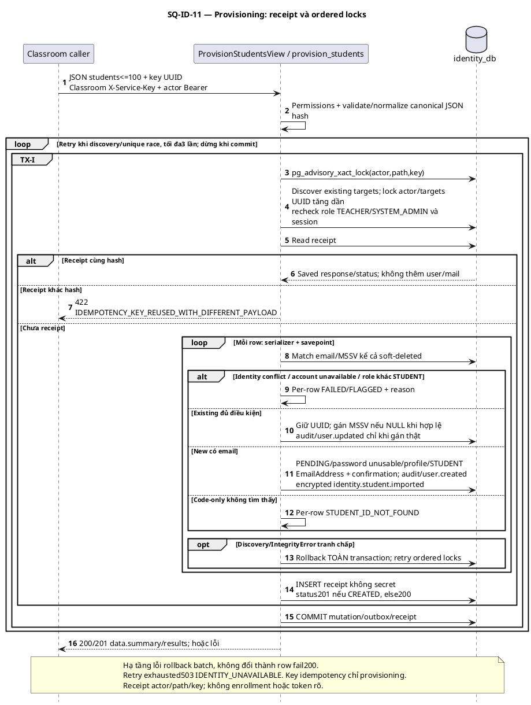
```plantuml
@startuml SQ-ID-11
skinparam defaultFontName Arial
skinparam shadowing false
skinparam sequenceMessageAlign left
skinparam responseMessageBelowArrow true
skinparam maxMessageSize 300
hide footbox
autonumber
title SQ-ID-11 — Provisioning: receipt và ordered locks
participant "Classroom caller" as C
participant "ProvisionStudentsView / provision_students" as I
database "identity_db" as D
C -> I : JSON students<=100 + key UUID\nClassroom X-Service-Key + actor Bearer
I -> I : Permissions + validate/normalize canonical JSON hash
loop Retry khi discovery/unique race, tối đa3 lần; dừng khi commit
 group TX-I
  I -> D : pg_advisory_xact_lock(actor,path,key)
  I -> D : Discover existing targets; lock actor/targets UUID tăng dần\nrecheck role TEACHER/SYSTEM_ADMIN và session
  I -> D : Read receipt
  alt Receipt cùng hash
   D --> I : Saved response/status; không thêm user/mail
  else Receipt khác hash
   I --> C : 422 IDEMPOTENCY_KEY_REUSED_WITH_DIFFERENT_PAYLOAD
  else Chưa receipt
   loop Mỗi row: serializer + savepoint
    I -> D : Match email/MSSV kể cả soft-deleted
    alt Identity conflict / account unavailable / role khác STUDENT
     I -> I : Per-row FAILED/FLAGGED + reason
    else Existing đủ điều kiện
     I -> D : Giữ UUID; gán MSSV nếu NULL khi hợp lệ\naudit/user.updated chỉ khi gán thật
    else New có email
     I -> D : PENDING/password unusable/profile/STUDENT\nEmailAddress + confirmation; audit/user.created\nencrypted identity.student.imported
    else Code-only không tìm thấy
     I -> I : Per-row STUDENT_ID_NOT_FOUND
    end
    opt Discovery/IntegrityError tranh chấp
     I -> D : Rollback TOÀN transaction; retry ordered locks
    end
   end
   I -> D : INSERT receipt không secret\nstatus201 nếu CREATED, else200
  end
  I -> D : COMMIT mutation/outbox/receipt
 end
end
I --> C : 200/201 data.summary/results; hoặc lỗi
note over C,D : Hạ tầng lỗi rollback batch, không đổi thành row fail200.\nRetry exhausted503 IDENTITY_UNAVAILABLE. Key idempotency chỉ provisioning.\nReceipt actor/path/key; không enrollment hoặc token rõ.
@enduml
```

## SQ-ID-12 — Resend activation nội bộ cho Classroom

Nguồn: [accounts/services/provisioning.py](../../../apps/identity-service/accounts/services/provisioning.py);
kiểm thử: [test_provisioning.py](../../../apps/identity-service/tests/test_provisioning.py).

Nguồn PlantUML

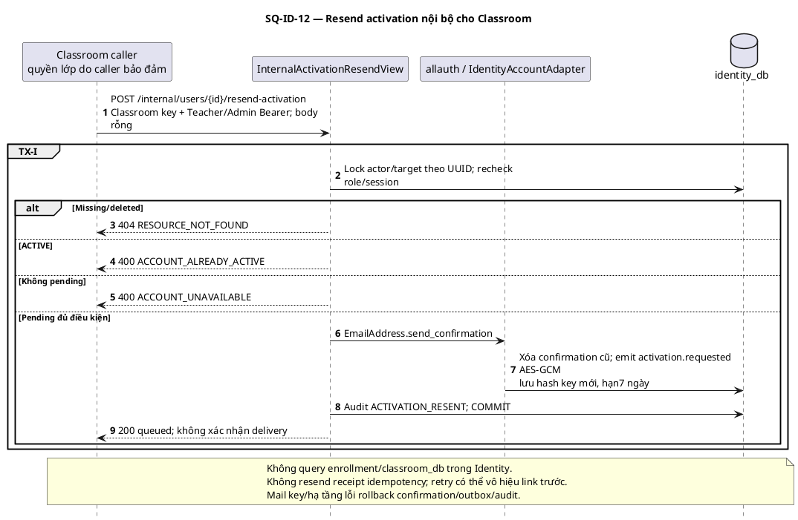
```plantuml
@startuml SQ-ID-12
skinparam defaultFontName Arial
skinparam shadowing false
skinparam sequenceMessageAlign left
skinparam responseMessageBelowArrow true
skinparam maxMessageSize 300
hide footbox
autonumber
title SQ-ID-12 — Resend activation nội bộ cho Classroom
participant "Classroom caller\nquyền lớp do caller bảo đảm" as C
participant "InternalActivationResendView" as I
participant "allauth / IdentityAccountAdapter" as A
database "identity_db" as D
C -> I : POST /internal/users/{id}/resend-activation\nClassroom key + Teacher/Admin Bearer; body rỗng
group TX-I
 I -> D : Lock actor/target theo UUID; recheck role/session
 alt Missing/deleted
  I --> C : 404 RESOURCE_NOT_FOUND
 else ACTIVE
  I --> C : 400 ACCOUNT_ALREADY_ACTIVE
 else Không pending
  I --> C : 400 ACCOUNT_UNAVAILABLE
 else Pending đủ điều kiện
  I -> A : EmailAddress.send_confirmation
  A -> D : Xóa confirmation cũ; emit activation.requested AES-GCM\nlưu hash key mới, hạn7 ngày
  I -> D : Audit ACTIVATION_RESENT; COMMIT
  I --> C : 200 queued; không xác nhận delivery
 end
end
note over C,D : Không query enrollment/classroom_db trong Identity.\nKhông resend receipt idempotency; retry có thể vô hiệu link trước.\nMail key/hạ tầng lỗi rollback confirmation/outbox/audit.
@enduml
```

## SQ-ID-13 — Google OAuth: context, allauth và các transaction riêng

Nguồn: [accounts/services/oauth_accounts.py](../../../apps/identity-service/accounts/services/oauth_accounts.py);
kiểm thử: [test_oauth_adapters.py](../../../apps/identity-service/tests/test_oauth_adapters.py).

Nguồn PlantUML

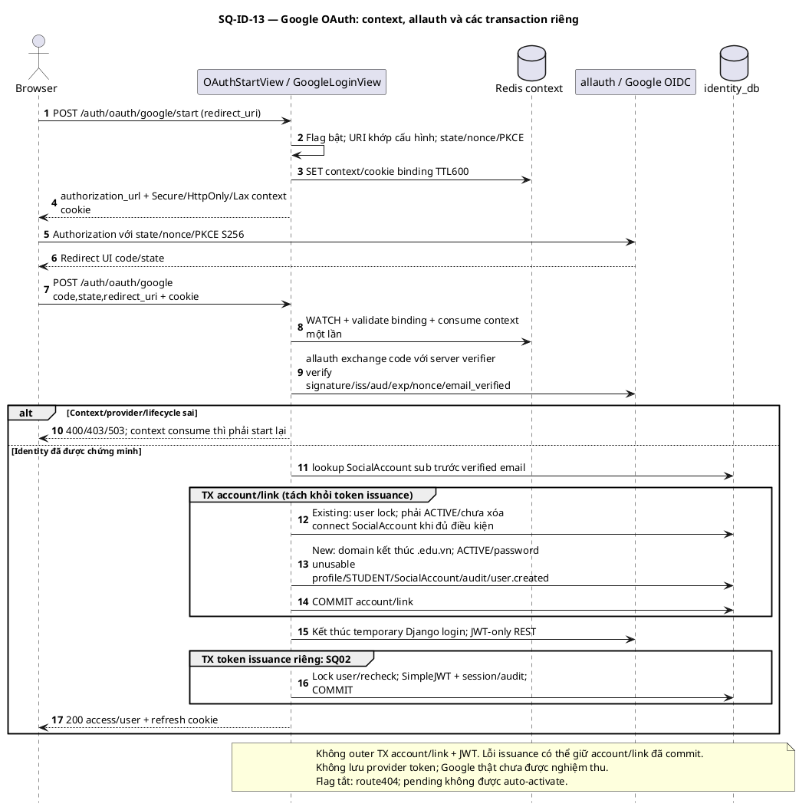
```plantuml
@startuml SQ-ID-13
skinparam defaultFontName Arial
skinparam shadowing false
skinparam sequenceMessageAlign left
skinparam responseMessageBelowArrow true
skinparam maxMessageSize 300
hide footbox
autonumber
title SQ-ID-13 — Google OAuth: context, allauth và các transaction riêng
actor "Browser" as U
participant "OAuthStartView / GoogleLoginView" as I
database "Redis context" as R
participant "allauth / Google OIDC" as G
database "identity_db" as D
U -> I : POST /auth/oauth/google/start (redirect_uri)
I -> I : Flag bật; URI khớp cấu hình; state/nonce/PKCE
I -> R : SET context/cookie binding TTL600
I --> U : authorization_url + Secure/HttpOnly/Lax context cookie
U -> G : Authorization với state/nonce/PKCE S256
G --> U : Redirect UI code/state
U -> I : POST /auth/oauth/google\ncode,state,redirect_uri + cookie
I -> R : WATCH + validate binding + consume context một lần
I -> G : allauth exchange code với server verifier\nverify signature/iss/aud/exp/nonce/email_verified
alt Context/provider/lifecycle sai
 I --> U : 400/403/503; context consume thì phải start lại
else Identity đã được chứng minh
 I -> D : lookup SocialAccount sub trước verified email
 group TX account/link (tách khỏi token issuance)
  I -> D : Existing: user lock; phải ACTIVE/chưa xóa\nconnect SocialAccount khi đủ điều kiện
  I -> D : New: domain kết thúc .edu.vn; ACTIVE/password unusable\nprofile/STUDENT/SocialAccount/audit/user.created
  I -> D : COMMIT account/link
 end
 I -> G : Kết thúc temporary Django login; JWT-only REST
 group TX token issuance riêng: SQ02
  I -> D : Lock user/recheck; SimpleJWT + session/audit; COMMIT
 end
 I --> U : 200 access/user + refresh cookie
end
note over I,D : Không outer TX account/link + JWT. Lỗi issuance có thể giữ account/link đã commit.\nKhông lưu provider token; Google thật chưa được nghiệm thu.\nFlag tắt: route404; pending không được auto-activate.
@enduml
```

## SQ-ID-14 — GitHub qua Integration và OAuth unlink

Nguồn: [accounts/services/oauth_accounts.py](../../../apps/identity-service/accounts/services/oauth_accounts.py);
kiểm thử: [test_oauth_adapters.py](../../../apps/identity-service/tests/test_oauth_adapters.py).

Nguồn PlantUML

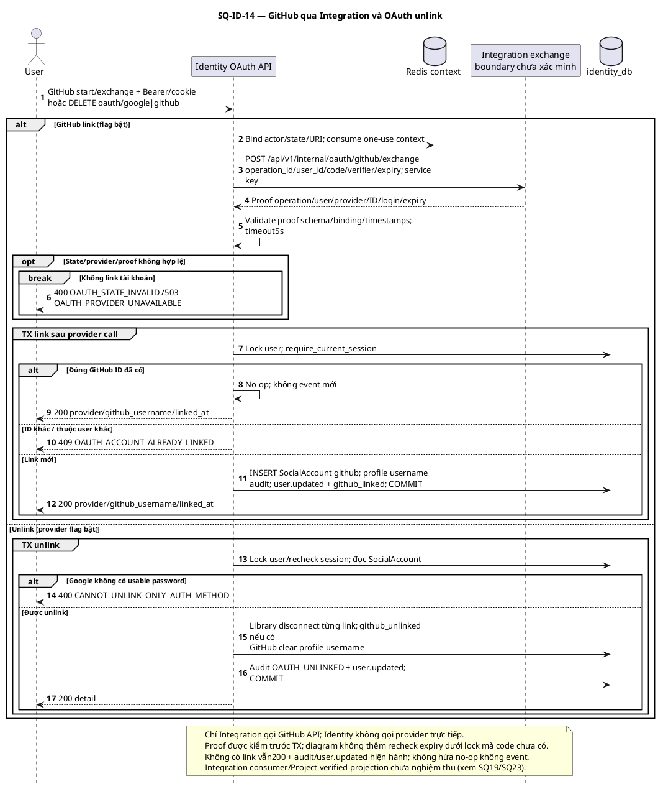
```plantuml
@startuml SQ-ID-14
skinparam defaultFontName Arial
skinparam shadowing false
skinparam sequenceMessageAlign left
skinparam responseMessageBelowArrow true
skinparam maxMessageSize 300
hide footbox
autonumber
title SQ-ID-14 — GitHub qua Integration và OAuth unlink
actor "User" as U
participant "Identity OAuth API" as I
database "Redis context" as R
participant "Integration exchange\nboundary chưa xác minh" as N
database "identity_db" as D
U -> I : GitHub start/exchange + Bearer/cookie\nhoặc DELETE oauth/google|github
alt GitHub link (flag bật)
 I -> R : Bind actor/state/URI; consume one-use context
 I -> N : POST /api/v1/internal/oauth/github/exchange\noperation_id/user_id/code/verifier/expiry; service key
 N --> I : Proof operation/user/provider/ID/login/expiry
 I -> I : Validate proof schema/binding/timestamps; timeout5s
 opt State/provider/proof không hợp lệ
  break Không link tài khoản
   I --> U : 400 OAUTH_STATE_INVALID /503 OAUTH_PROVIDER_UNAVAILABLE
  end
 end
 group TX link sau provider call
  I -> D : Lock user; require_current_session
  alt Đúng GitHub ID đã có
   I -> I : No-op; không event mới
   I --> U : 200 provider/github_username/linked_at
  else ID khác / thuộc user khác
   I --> U : 409 OAUTH_ACCOUNT_ALREADY_LINKED
  else Link mới
   I -> D : INSERT SocialAccount github; profile username\naudit; user.updated + github_linked; COMMIT
   I --> U : 200 provider/github_username/linked_at
  end
 end
else Unlink (provider flag bật)
 group TX unlink
  I -> D : Lock user/recheck session; đọc SocialAccount
  alt Google không có usable password
   I --> U : 400 CANNOT_UNLINK_ONLY_AUTH_METHOD
  else Được unlink
   I -> D : Library disconnect từng link; github_unlinked nếu có\nGitHub clear profile username
   I -> D : Audit OAUTH_UNLINKED + user.updated; COMMIT
   I --> U : 200 detail
  end
 end
end
note over I,N : Chỉ Integration gọi GitHub API; Identity không gọi provider trực tiếp.\nProof được kiểm trước TX; diagram không thêm recheck expiry dưới lock mà code chưa có.\nKhông có link vẫn200 + audit/user.updated hiện hành; không hứa no-op không event.\nIntegration consumer/Project verified projection chưa nghiệm thu (xem SQ19/SQ23).
@enduml
```

## SQ-ID-15 — PATCH hồ sơ: chỉ mutation thật mới phát event

Nguồn: [accounts/services/profiles.py](../../../apps/identity-service/accounts/services/profiles.py);
kiểm thử: [test_api_completion.py](../../../apps/identity-service/tests/test_api_completion.py).

Nguồn PlantUML

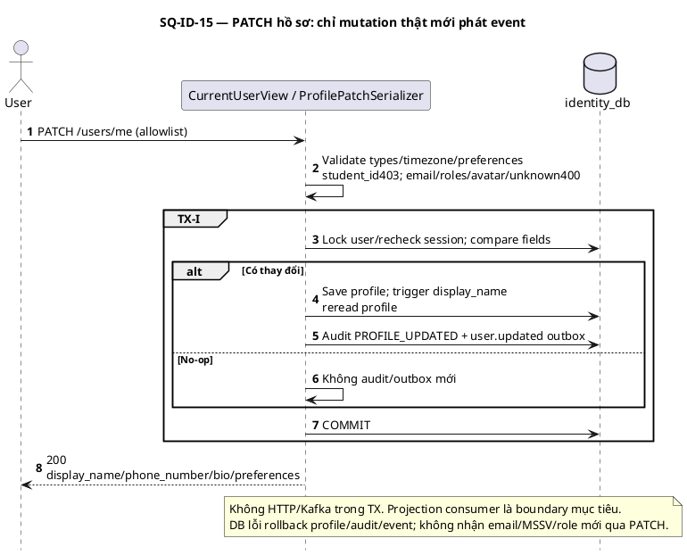
```plantuml
@startuml SQ-ID-15
skinparam defaultFontName Arial
skinparam shadowing false
skinparam sequenceMessageAlign left
skinparam responseMessageBelowArrow true
skinparam maxMessageSize 300
hide footbox
autonumber
title SQ-ID-15 — PATCH hồ sơ: chỉ mutation thật mới phát event
actor "User" as U
participant "CurrentUserView / ProfilePatchSerializer" as I
database "identity_db" as D
U -> I : PATCH /users/me (allowlist)
I -> I : Validate types/timezone/preferences\nstudent_id403; email/roles/avatar/unknown400
group TX-I
 I -> D : Lock user/recheck session; compare fields
 alt Có thay đổi
  I -> D : Save profile; trigger display_name\nreread profile
  I -> D : Audit PROFILE_UPDATED + user.updated outbox
 else No-op
  I -> I : Không audit/outbox mới
 end
 I -> D : COMMIT
end
I --> U : 200 display_name/phone_number/bio/preferences
note over I,D : Không HTTP/Kafka trong TX. Projection consumer là boundary mục tiêu.\nDB lỗi rollback profile/audit/event; không nhận email/MSSV/role mới qua PATCH.
@enduml
```

## SQ-ID-16 — Avatar receipt bound user và session

Nguồn: [accounts/services/avatars.py](../../../apps/identity-service/accounts/services/avatars.py);
kiểm thử: [test_avatars.py](../../../apps/identity-service/tests/test_avatars.py).

Nguồn PlantUML

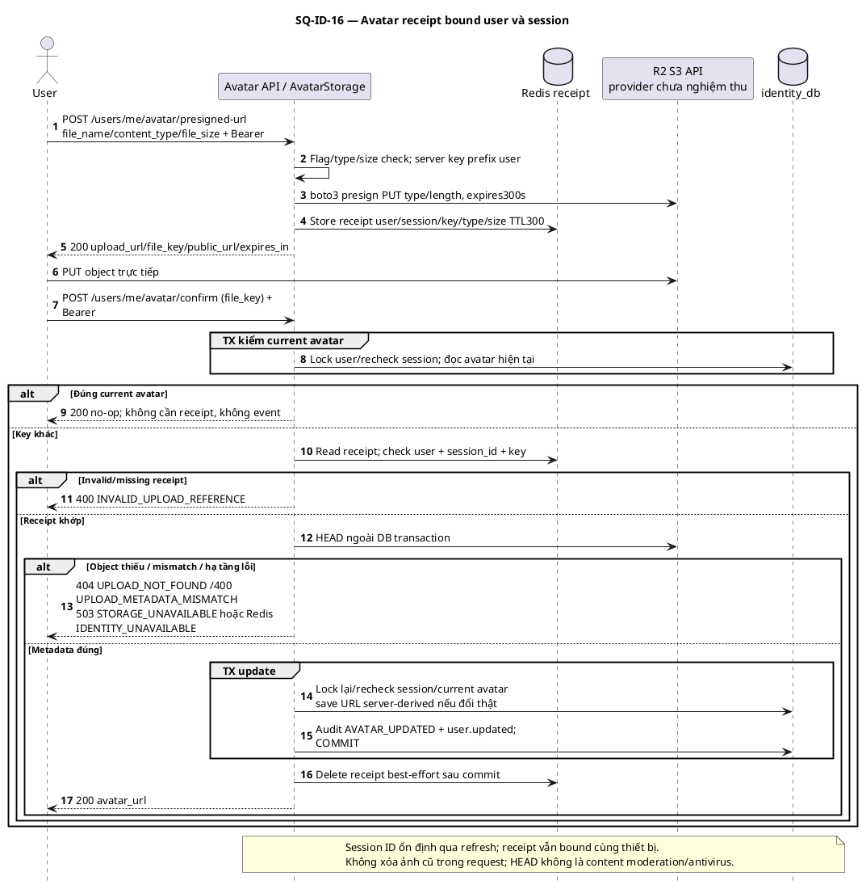
```plantuml
@startuml SQ-ID-16
skinparam defaultFontName Arial
skinparam shadowing false
skinparam sequenceMessageAlign left
skinparam responseMessageBelowArrow true
skinparam maxMessageSize 300
hide footbox
autonumber
title SQ-ID-16 — Avatar receipt bound user và session
actor "User" as U
participant "Avatar API / AvatarStorage" as I
database "Redis receipt" as R
participant "R2 S3 API\nprovider chưa nghiệm thu" as S
database "identity_db" as D
U -> I : POST /users/me/avatar/presigned-url\nfile_name/content_type/file_size + Bearer
I -> I : Flag/type/size check; server key prefix user
I -> S : boto3 presign PUT type/length, expires300s
I -> R : Store receipt user/session/key/type/size TTL300
I --> U : 200 upload_url/file_key/public_url/expires_in
U -> S : PUT object trực tiếp
U -> I : POST /users/me/avatar/confirm (file_key) + Bearer
group TX kiểm current avatar
 I -> D : Lock user/recheck session; đọc avatar hiện tại
end
alt Đúng current avatar
 I --> U : 200 no-op; không cần receipt, không event
else Key khác
 I -> R : Read receipt; check user + session_id + key
 alt Invalid/missing receipt
  I --> U : 400 INVALID_UPLOAD_REFERENCE
 else Receipt khớp
  I -> S : HEAD ngoài DB transaction
  alt Object thiếu / mismatch / hạ tầng lỗi
   I --> U : 404 UPLOAD_NOT_FOUND /400 UPLOAD_METADATA_MISMATCH\n503 STORAGE_UNAVAILABLE hoặc Redis IDENTITY_UNAVAILABLE
  else Metadata đúng
   group TX update
    I -> D : Lock lại/recheck session/current avatar\nsave URL server-derived nếu đổi thật
    I -> D : Audit AVATAR_UPDATED + user.updated; COMMIT
   end
   I -> R : Delete receipt best-effort sau commit
   I --> U : 200 avatar_url
  end
 end
end
note over I,D : Session ID ổn định qua refresh; receipt vẫn bound cùng thiết bị.\nKhông xóa ảnh cũ trong request; HEAD không là content moderation/antivirus.
@enduml
```

## SQ-ID-17 — Admin status/restore: mọi mutation thu hồi phiên

Nguồn: [accounts/services/administration.py](../../../apps/identity-service/accounts/services/administration.py);
kiểm thử: [test_api_completion.py](../../../apps/identity-service/tests/test_api_completion.py).

Nguồn PlantUML

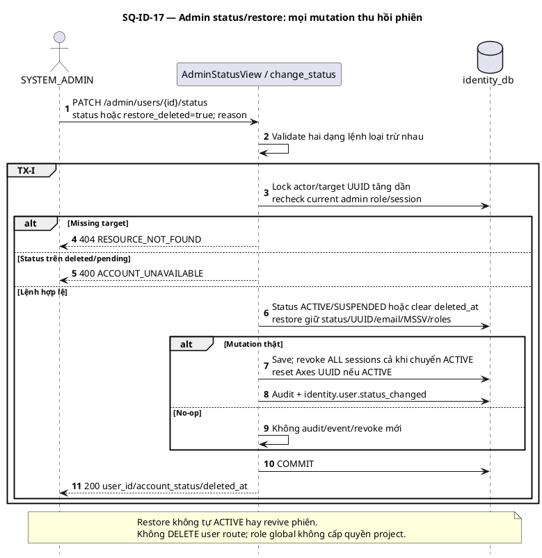
```plantuml
@startuml SQ-ID-17
skinparam defaultFontName Arial
skinparam shadowing false
skinparam sequenceMessageAlign left
skinparam responseMessageBelowArrow true
skinparam maxMessageSize 300
hide footbox
autonumber
title SQ-ID-17 — Admin status/restore: mọi mutation thu hồi phiên
actor "SYSTEM_ADMIN" as U
participant "AdminStatusView / change_status" as I
database "identity_db" as D
U -> I : PATCH /admin/users/{id}/status\nstatus hoặc restore_deleted=true; reason
I -> I : Validate hai dạng lệnh loại trừ nhau
group TX-I
 I -> D : Lock actor/target UUID tăng dần\nrecheck current admin role/session
 alt Missing target
  I --> U : 404 RESOURCE_NOT_FOUND
 else Status trên deleted/pending
  I --> U : 400 ACCOUNT_UNAVAILABLE
 else Lệnh hợp lệ
  I -> D : Status ACTIVE/SUSPENDED hoặc clear deleted_at\nrestore giữ status/UUID/email/MSSV/roles
  alt Mutation thật
   I -> D : Save; revoke ALL sessions cả khi chuyển ACTIVE\nreset Axes UUID nếu ACTIVE
   I -> D : Audit + identity.user.status_changed
  else No-op
   I -> I : Không audit/event/revoke mới
  end
  I -> D : COMMIT
  I --> U : 200 user_id/account_status/deleted_at
 end
end
note over U,D : Restore không tự ACTIVE hay revive phiên.\nKhông DELETE user route; role global không cấp quyền project.
@enduml
```

## SQ-ID-18 — Admin role và revoke credential

Nguồn: [accounts/services/administration.py](../../../apps/identity-service/accounts/services/administration.py);
kiểm thử: [test_api_completion.py](../../../apps/identity-service/tests/test_api_completion.py).

Nguồn PlantUML

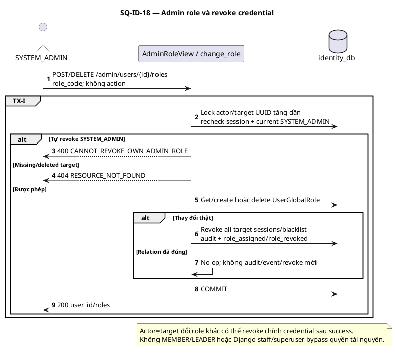
```plantuml
@startuml SQ-ID-18
skinparam defaultFontName Arial
skinparam shadowing false
skinparam sequenceMessageAlign left
skinparam responseMessageBelowArrow true
skinparam maxMessageSize 300
hide footbox
autonumber
title SQ-ID-18 — Admin role và revoke credential
actor "SYSTEM_ADMIN" as U
participant "AdminRoleView / change_role" as I
database "identity_db" as D
U -> I : POST/DELETE /admin/users/{id}/roles\nrole_code; không action
group TX-I
 I -> D : Lock actor/target UUID tăng dần\nrecheck session + current SYSTEM_ADMIN
 alt Tự revoke SYSTEM_ADMIN
  I --> U : 400 CANNOT_REVOKE_OWN_ADMIN_ROLE
 else Missing/deleted target
  I --> U : 404 RESOURCE_NOT_FOUND
 else Được phép
  I -> D : Get/create hoặc delete UserGlobalRole
  alt Thay đổi thật
   I -> D : Revoke all target sessions/blacklist\naudit + role_assigned/role_revoked
  else Relation đã đúng
   I -> I : No-op; không audit/event/revoke mới
  end
  I -> D : COMMIT
  I --> U : 200 user_id/roles
 end
end
note over I,D : Actor=target đổi role khác có thể revoke chính credential sau success.\nKhông MEMBER/LEADER hoặc Django staff/superuser bypass quyền tài nguyên.
@enduml
```

## SQ-ID-19 — Ghi outbox hiện hành và handoff mục tiêu

Nguồn: [messaging/outbox.py](../../../apps/identity-service/messaging/outbox.py);
kiểm thử: [test_audit.py](../../../apps/identity-service/tests/test_audit.py).

Nguồn PlantUML

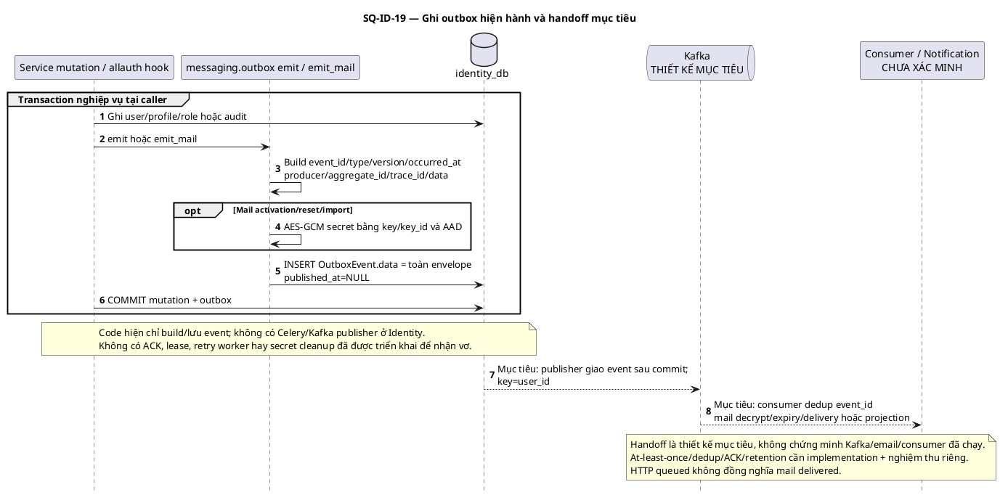
```plantuml
@startuml SQ-ID-19
skinparam defaultFontName Arial
skinparam shadowing false
skinparam sequenceMessageAlign left
skinparam responseMessageBelowArrow true
skinparam maxMessageSize 300
hide footbox
autonumber
title SQ-ID-19 — Ghi outbox hiện hành và handoff mục tiêu
participant "Service mutation / allauth hook" as S
participant "messaging.outbox emit / emit_mail" as M
database "identity_db" as D
queue "Kafka\nTHIẾT KẾ MỤC TIÊU" as K
participant "Consumer / Notification\nCHƯA XÁC MINH" as N
group Transaction nghiệp vụ tại caller
 S -> D : Ghi user/profile/role hoặc audit
 S -> M : emit hoặc emit_mail
 M -> M : Build event_id/type/version/occurred_at\nproducer/aggregate_id/trace_id/data
 opt Mail activation/reset/import
  M -> M : AES-GCM secret bằng key/key_id và AAD
 end
 M -> D : INSERT OutboxEvent.data = toàn envelope\npublished_at=NULL
 S -> D : COMMIT mutation + outbox
end
note over S,D : Code hiện chỉ build/lưu event; không có Celery/Kafka publisher ở Identity.\nKhông có ACK, lease, retry worker hay secret cleanup đã được triển khai để nhận vơ.
D --> K : Mục tiêu: publisher giao event sau commit; key=user_id
K --> N : Mục tiêu: consumer dedup event_id\nmail decrypt/expiry/delivery hoặc projection
note over K,N : Handoff là thiết kế mục tiêu, không chứng minh Kafka/email/consumer đã chạy.\nAt-least-once/dedup/ACK/retention cần implementation + nghiệm thu riêng.\nHTTP queued không đồng nghĩa mail delivered.
@enduml
```

## SQ-ID-20 — JWKS một khóa RS256 hiện hành

Nguồn: [authentication/adapters/session_tokens.py](../../../apps/identity-service/authentication/adapters/session_tokens.py);
kiểm thử: [test_jwt.py](../../../apps/identity-service/tests/test_jwt.py).

Nguồn PlantUML

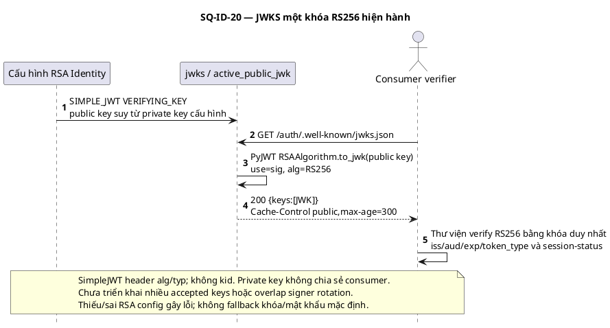
```plantuml
@startuml SQ-ID-20
skinparam defaultFontName Arial
skinparam shadowing false
skinparam sequenceMessageAlign left
skinparam responseMessageBelowArrow true
skinparam maxMessageSize 300
hide footbox
autonumber
title SQ-ID-20 — JWKS một khóa RS256 hiện hành
participant "Cấu hình RSA Identity" as C
participant "jwks / active_public_jwk" as I
actor "Consumer verifier" as S
C -> I : SIMPLE_JWT VERIFYING_KEY\npublic key suy từ private key cấu hình
S -> I : GET /auth/.well-known/jwks.json
I -> I : PyJWT RSAAlgorithm.to_jwk(public key)\nuse=sig, alg=RS256
I --> S : 200 {keys:[JWK]}\nCache-Control public,max-age=300
S -> S : Thư viện verify RS256 bằng khóa duy nhất\niss/aud/exp/token_type và session-status
note over C,S : SimpleJWT header alg/typ; không kid. Private key không chia sẻ consumer.\nChưa triển khai nhiều accepted keys hoặc overlap signer rotation.\nThiếu/sai RSA config gây lỗi; không fallback khóa/mật khẩu mặc định.
@enduml
```

## SQ-ID-21 — Đọc hồ sơ, batch, sessions và admin list

Nguồn: [accounts/views/profiles.py](../../../apps/identity-service/accounts/views/profiles.py);
kiểm thử: [test_api_completion.py](../../../apps/identity-service/tests/test_api_completion.py).

Nguồn PlantUML

```plantuml
@startuml SQ-ID-21
skinparam defaultFontName Arial
skinparam shadowing false
skinparam sequenceMessageAlign left
skinparam responseMessageBelowArrow true
skinparam maxMessageSize 300
hide footbox
autonumber
title SQ-ID-21 — Đọc hồ sơ, batch, sessions và admin list
actor "User / Admin" as U
participant "Identity read views / serializers" as I
database "identity_db" as D
U -> I : GET users/me|users/{UUID}|auth/sessions|admin/users\nhoặc POST users/batch
I -> I : IdentityJWTAuthentication kiểm live credential
alt Admin list
 I -> D : Require current SYSTEM_ADMIN
 I -> I : Validate search/role/status/page/limit<=100
else Batch
 I -> I : Validate user_ids<=100; dedup giữ thứ tự
end
I -> D : Query scoped me/sessions; public/batch non-deleted\nadmin filtered/paginated
D --> I : User/profile/roles hoặc session metadata
I -> I : Serialize allowlist; không password/hash/token
alt Single user missing/deleted
 I --> U : 404 RESOURCE_NOT_FOUND
else Có kết quả (batch có thể thiếu IDs)
 I --> U : 200 data theo endpoint\nbatch meta.total; admin meta pagination
end
note over I,D : Device id/family ổn định; is_current theo family.\nPublic/batch có email/MSSV cho Bearer theo policy hiện hành, không preferences.\nUUID converter sai path404; chưa có quyền scope lớp/project trên lookup này.
@enduml
```

## SQ-ID-22 — Resend activation public

Nguồn: [authentication/views/registration.py](../../../apps/identity-service/authentication/views/registration.py);
kiểm thử: [test_flows.py](../../../apps/identity-service/tests/test_flows.py).

Nguồn PlantUML

```plantuml
@startuml SQ-ID-22
skinparam defaultFontName Arial
skinparam shadowing false
skinparam sequenceMessageAlign left
skinparam responseMessageBelowArrow true
skinparam maxMessageSize 300
hide footbox
autonumber
title SQ-ID-22 — Resend activation public
actor "Guest" as U
participant "ActivationResendView" as I
participant "allauth / IdentityAccountAdapter" as A
database "identity_db" as D
U -> I : POST /auth/activation/resend (email)
I -> I : mail_key(); validate/normalize; recovery throttle
I -> D : Lookup unverified EmailAddress
alt Pending/chưa xóa, email đủ điều kiện
 group TX-I
  I -> D : Lock user; recheck pending/deleted
  I -> A : address.send_confirmation
  A -> D : Xóa key cũ; emit activation.requested AES-GCM\nlưu hash confirmation mới; COMMIT
 end
else Unknown/verified/active/suspended/deleted
 I -> I : Không confirmation/mail event mới
end
I --> U : 200 message trung tính; data=null
note over U,D : Key lỗi503 cho known/unknown; email sai400; throttle429.\nKhông idempotency receipt; resend có thể hủy link trước; không tự activation/JWT.
@enduml
```

## SQ-ID-23 — GitHub mapping nội bộ cho reconciliation

Nguồn: [accounts/views/internal.py](../../../apps/identity-service/accounts/views/internal.py);
kiểm thử: [test_api_completion.py](../../../apps/identity-service/tests/test_api_completion.py).

Nguồn PlantUML

```plantuml
@startuml SQ-ID-23
skinparam defaultFontName Arial
skinparam shadowing false
skinparam sequenceMessageAlign left
skinparam responseMessageBelowArrow true
skinparam maxMessageSize 300
hide footbox
autonumber
title SQ-ID-23 — GitHub mapping nội bộ cho reconciliation
participant "Integration caller" as N
participant "GitHubMappingView" as I
database "identity_db" as D
N -> I : GET /internal/users/{user_id}/oauth/GITHUB\nIntegration X-Service-Key
I -> I : ServiceKeyPermission; không actor Bearer
alt Key sai / không có
 I --> N : 403 SERVICE_ACCESS_DENIED
else Key hợp lệ
 I -> D : Read github SocialAccount của user chưa xóa
 alt Missing/deleted/unlinked
  I --> N : 200 data.user_id + mapping=null
 else Có link
  I --> N : 200 mapping.provider_user_id/github_username
 end
end
note over N,D : Route có sẵn mặc định, không phụ thuộc flag link GitHub.\nKhông trả email/provider token; Integration/Project projection là boundary mục tiêu.\nCurrent mapping là snapshot, không distributed lock/dedup implementation.
@enduml
```

## 3. Giới hạn hiện hành và nghiệm thu bên ngoài

Các nhánh Classroom enrollment, consumer session-status, Integration proof/reconciliation,
Kafka publisher/ACK và Notification delivery là boundary mục tiêu/chưa xác minh.
Source/test mock phía Identity không chứng minh các service này đã triển khai hoặc chạy.
OAuth/R2 cần test với provider thật và cấu hình flags/credential phù hợp.

Google không có outer transaction chung account/link và token issuance. Unlink không có
link vẫn200 và ghi audit/user.updated. GitHub proof được kiểm trước user transaction,
không có recheck expiry dưới lock. Đây là mô tả code hiện hành, không cam kết mạnh hơn.
Không có nhiều JWKS keys/kid/rotation overlap; không có publisher hoặc retention worker
trong source Identity hiện tại. Giữ các giới hạn này khi xây consumer hoặc lập test E2E.

Sơ đồ và SVG mô tả cùng nguồn PlantUML. Render thành công chỉ xác minh tài liệu,
không thay kết quả regression PostgreSQL/provider/Kafka/consumer.
