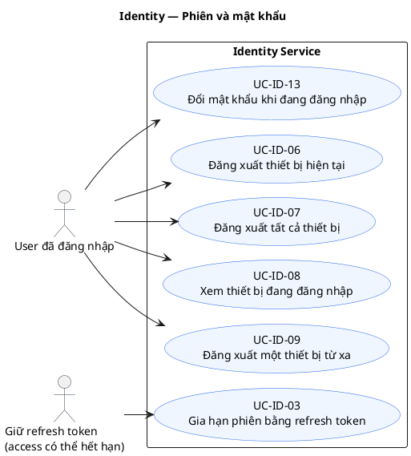
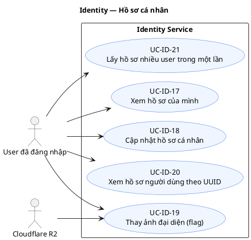
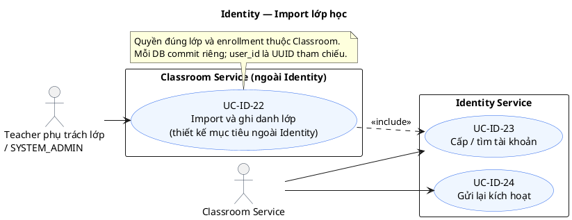
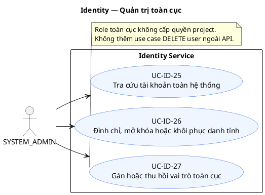
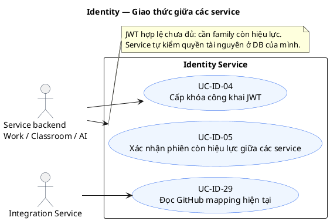
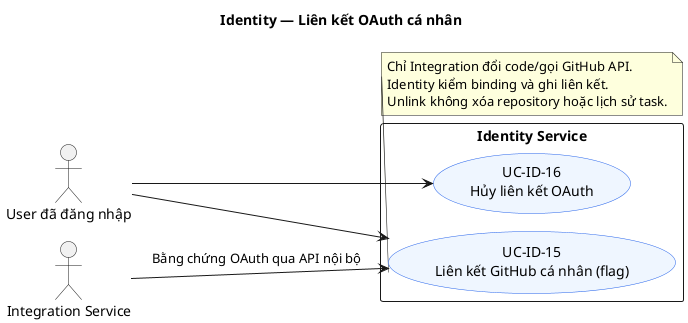

# Identity Service — Use case hiện hành

Đối chiếu source ngày 2026-10-07. **Trạng thái: Một phần**: luồng Identity có code và
pytest; sơ đồ không xác nhận provider hoặc consumer bên ngoài đã được nghiệm thu.

[Chỉ mục](README.md) · [Sequence](sequence.md) · [ERD](erd.md) ·
[Hướng dẫn tích hợp](../../identity-service/README.md) ·
[API](../../architecture/Identity_Service_API_Specification.md)

## 1. Phạm vi và cách đọc

Identity sở hữu user/profile/global role/session/audit/outbox/receipt. Django Auth,
dj-rest-auth, allauth, SimpleJWT, Axes và Argon2 thực thi các bước xác thực tương ứng.
Classroom sở hữu enrollment; Project sở hữu membership/quyền tài nguyên; chỉ Integration
gọi GitHub API. Không đọc DB hoặc tạo FK xuyên service. SYSTEM_ADMIN không tự có quyền
vào mọi lớp/project. Guest không phải global role; MEMBER/LEADER thuộc tài nguyên.

Các route dưới đây là đường nội bộ của service, không có dấu `/` cuối.
Mặc định có 25 operations trên 23 paths nghiệp vụ; OAuth/avatar thêm 8 operations
khi flags bật. `healthz`, OpenAPI/Swagger là routes hỗ trợ. GET activate trả405.
UC-ID-22 là **thiết kế mục tiêu ngoài Identity**; các bước consumer/provider không được
coi là đã chạy chỉ vì code Identity gọi tới boundary đó.

Response dùng envelope `success/message/data/meta/error`; lỗi có `details` là mảng.
JWKS trả `keys` ở root. Validation của thư viện thường là400 VALIDATION_ERROR;
không suy diễn mã lỗi riêng từ tên use case. Secret không trả trong receipt/audit/log.

## 2. Sơ đồ use case

Actor chỉ đặt ngoài boundary. Worker/outbox/DB không là actor của use case người dùng. Chỉ dùng include cho bước bắt buộc import → provisioning; không dùng extend để biểu diễn một endpoint gọi sau endpoint khác.

### Tài khoản và khôi phục


<details>
<summary>Nguồn PlantUML</summary>

```plantuml
@startuml UC-ID-MAP-01
!pragma layout smetana
left to right direction
skinparam defaultFontName Arial
skinparam shadowing false
skinparam packageStyle rectangle
skinparam usecaseBackgroundColor #EFF6FF
skinparam usecaseBorderColor #2563EB
skinparam actorBorderColor #334155
title Identity — Tài khoản và khôi phục
actor "Guest / giữ mã email" as A
actor "Google IdP" as P
rectangle "Identity Service" {
usecase "UC-ID-01\nĐăng ký tài khoản Student" as U1
usecase "UC-ID-02\nĐăng nhập bằng mật khẩu" as U2
usecase "UC-ID-10\nYêu cầu thư đặt lại mật khẩu" as U10
usecase "UC-ID-11\nXác nhận đặt lại mật khẩu" as U11
usecase "UC-ID-12\nXác minh và kích hoạt tài khoản" as U12
usecase "UC-ID-14\nĐăng nhập bằng Google (flag)" as U14
usecase "UC-ID-28\nGửi lại kích hoạt public" as U28
}
A --> U1
A --> U2
A --> U10
A --> U11
A --> U12
A --> U14
A --> U28
P --> U14
@enduml
```

</details>

### Phiên và mật khẩu


<details>
<summary>Nguồn PlantUML</summary>



</details>

### Hồ sơ cá nhân


<details>
<summary>Nguồn PlantUML</summary>



</details>

### Import lớp học


<details>
<summary>Nguồn PlantUML</summary>



</details>

### Quản trị toàn cục


<details>
<summary>Nguồn PlantUML</summary>



</details>

### Giao thức giữa các service


<details>
<summary>Nguồn PlantUML</summary>



</details>

### Liên kết OAuth cá nhân


<details>
<summary>Nguồn PlantUML</summary>



</details>

## 3. Danh mục và đặc tả

| Use case | API / boundary | Sequence |
| --- | --- | --- |
| [UC-ID-01](#uc-id-01) Đăng ký tài khoản Student | `POST /register` | [SQ-ID-01](sequence.md#sq-id-01) |
| [UC-ID-02](#uc-id-02) Đăng nhập bằng mật khẩu | `POST /login` | [SQ-ID-02](sequence.md#sq-id-02) |
| [UC-ID-03](#uc-id-03) Gia hạn phiên bằng refresh JWT | `POST /refresh` | [SQ-ID-03](sequence.md#sq-id-03) |
| [UC-ID-04](#uc-id-04) Cấp khóa công khai JWT | `GET /.well-known/jwks.json` | [SQ-ID-20](sequence.md#sq-id-20) |
| [UC-ID-05](#uc-id-05) Kiểm tra phiên giữa các service | `POST /api/v1/internal/auth/session-status` | [SQ-ID-04](sequence.md#sq-id-04) |
| [UC-ID-06](#uc-id-06) Đăng xuất thiết bị hiện tại | `POST /logout` | [SQ-ID-05](sequence.md#sq-id-05) |
| [UC-ID-07](#uc-id-07) Đăng xuất tất cả thiết bị | `POST /logout-all` | [SQ-ID-05](sequence.md#sq-id-05) |
| [UC-ID-08](#uc-id-08) Xem thiết bị đang đăng nhập | `GET /sessions` | [SQ-ID-21](sequence.md#sq-id-21) |
| [UC-ID-09](#uc-id-09) Đăng xuất thiết bị từ xa | `DELETE /sessions/{session_id}` | [SQ-ID-05](sequence.md#sq-id-05) |
| [UC-ID-10](#uc-id-10) Yêu cầu đặt lại mật khẩu | `POST /password-reset/request` | [SQ-ID-06](sequence.md#sq-id-06) |
| [UC-ID-11](#uc-id-11) Xác nhận đặt lại mật khẩu | `POST /password-reset/confirm` | [SQ-ID-07](sequence.md#sq-id-07) |
| [UC-ID-12](#uc-id-12) Xác minh và kích hoạt tài khoản | `POST /activate` | [SQ-ID-09](sequence.md#sq-id-09) |
| [UC-ID-13](#uc-id-13) Đổi mật khẩu khi đang đăng nhập | `POST /password-change` | [SQ-ID-08](sequence.md#sq-id-08) |
| [UC-ID-14](#uc-id-14) Đăng nhập bằng Google | `POST /oauth/google/start; POST /oauth/google` | [SQ-ID-13](sequence.md#sq-id-13) |
| [UC-ID-15](#uc-id-15) Liên kết GitHub cá nhân | `POST /oauth/github/start; POST /oauth/github` | [SQ-ID-14](sequence.md#sq-id-14) |
| [UC-ID-16](#uc-id-16) Hủy liên kết OAuth | `DELETE /oauth/google; DELETE /oauth/github` | [SQ-ID-14](sequence.md#sq-id-14) |
| [UC-ID-17](#uc-id-17) Xem hồ sơ của mình | `GET /users/me` | [SQ-ID-21](sequence.md#sq-id-21) |
| [UC-ID-18](#uc-id-18) Cập nhật hồ sơ cá nhân | `PATCH /users/me` | [SQ-ID-15](sequence.md#sq-id-15) |
| [UC-ID-19](#uc-id-19) Thay ảnh đại diện | `POST /users/me/avatar/presigned-url; POST /users/me/avatar/confirm` | [SQ-ID-16](sequence.md#sq-id-16) |
| [UC-ID-20](#uc-id-20) Xem hồ sơ người dùng theo UUID | `GET /users/{user_id}` | [SQ-ID-21](sequence.md#sq-id-21) |
| [UC-ID-21](#uc-id-21) Lấy nhiều hồ sơ | `POST /users/batch` | [SQ-ID-21](sequence.md#sq-id-21) |
| [UC-ID-22](#uc-id-22) Import và ghi danh lớp — boundary mục tiêu | `Classroom: POST /api/v1/classrooms/{classroom_id}/students/import` | [SQ-ID-10](sequence.md#sq-id-10) |
| [UC-ID-23](#uc-id-23) Cấp hoặc tìm Student cho Classroom | `POST /api/v1/internal/users/provision-students` | [SQ-ID-11](sequence.md#sq-id-11) |
| [UC-ID-24](#uc-id-24) Resend kích hoạt nội bộ | `POST /api/v1/internal/users/{user_id}/resend-activation` | [SQ-ID-12](sequence.md#sq-id-12) |
| [UC-ID-25](#uc-id-25) Tra cứu tài khoản toàn hệ thống | `GET /admin/users` | [SQ-ID-21](sequence.md#sq-id-21) |
| [UC-ID-26](#uc-id-26) Đổi status hoặc khôi phục xóa mềm | `PATCH /admin/users/{user_id}/status` | [SQ-ID-17](sequence.md#sq-id-17) |
| [UC-ID-27](#uc-id-27) Gán hoặc thu hồi global role | `POST/DELETE /admin/users/{user_id}/roles` | [SQ-ID-18](sequence.md#sq-id-18) |
| [UC-ID-28](#uc-id-28) Resend kích hoạt public | `POST /activation/resend` | [SQ-ID-22](sequence.md#sq-id-22) |
| [UC-ID-29](#uc-id-29) Đọc mapping GitHub hiện tại | `GET /api/v1/internal/users/{user_id}/oauth/GITHUB` | [SQ-ID-23](sequence.md#sq-id-23) |

<a id="uc-id-01"></a>

### UC-ID-01 — Đăng ký tài khoản Student

**API / actor:** `POST /register`. Guest; username, email, password1, password2, first_name, last_name.

**Luồng:** Kiểm mail key, từ chối Idempotency-Key, validate bằng RegisterSerializer. Một transaction tạo PENDING_ACTIVATION, profile, STUDENT, audit REGISTER, user.created và activation.requested mã hóa. Trả201 data.user/account_status; chưa cấp JWT. Kích hoạt rồi login riêng.

**Lỗi và giới hạn:** 400 VALIDATION_ERROR cho duplicate/unknown field/password/key header;429 throttle; thiếu mail key503. Không nhận role/MSSV và không sinh username thay input đăng ký.

Nguồn: [authentication/views/registration.py](../../../apps/identity-service/authentication/views/registration.py);
kiểm thử: [test_registration.py](../../../apps/identity-service/tests/test_registration.py);
[SQ-ID-01](sequence.md#sq-id-01). Các file test là bằng chứng thiết kế kiểm thử,
không phải kết quả chạy provider thật trong lần cập nhật tài liệu này.

<a id="uc-id-02"></a>

### UC-ID-02 — Đăng nhập bằng mật khẩu

**API / actor:** `POST /login`. Guest; đúng một trong email/username, password; device_name tùy chọn.

**Luồng:** Django authenticate/allauth kiểm credential; Axes kiểm user UUID và IP. Credentials đúng mới kiểm pending/suspended. Khóa user và recheck password/state khi SimpleJWT cấp token, tạo một session/family, audit và user_logged_in signal. Trả200 access/user; refresh body rỗng, refresh JWT trong cookie.

**Lỗi và giới hạn:** 401 INVALID_CREDENTIALS cho sai/không tồn tại/deleted/unusable;403 pending/suspended. Axes 5 lần sai, cooldown15 phút,429/Retry-After900; không đổi account_status hay revoke phiên đang sống.

Nguồn: [authentication/serializers/auth.py](../../../apps/identity-service/authentication/serializers/auth.py);
kiểm thử: [test_login.py](../../../apps/identity-service/tests/test_login.py);
[SQ-ID-02](sequence.md#sq-id-02). Các file test là bằng chứng thiết kế kiểm thử,
không phải kết quả chạy provider thật trong lần cập nhật tài liệu này.

<a id="uc-id-03"></a>

### UC-ID-03 — Gia hạn phiên bằng refresh JWT

**API / actor:** `POST /refresh`. JWT refresh từ body hoặc cookie; có cookie phải qua CSRF/Origin.

**Luồng:** UntypedToken xác minh JWT trước tra DB; khóa user, kiểm session_id/sub/token_family. SimpleJWT rotate/blacklist rồi cập nhật hash/JTI trên cùng UserSession. session_id, family và hạn family7 ngày giữ nguyên. Trả200 access/access_expiration và cookie mới, không raw refresh trong body.

**Lỗi và giới hạn:** Cookie/body khác nhau400; signature/expiry sai bị thư viện từ chối. Refresh cũ còn hạn/hash khác: commit revoke family và audit rồi401 TOKEN_REPLAY_ATTACK_DETECTED. Concurrent refresh một200/một401, family bị revoke. Không grace window; client single-flight.

Nguồn: [authentication/services/session_service.py](../../../apps/identity-service/authentication/services/session_service.py);
kiểm thử: [test_rotation.py](../../../apps/identity-service/tests/test_rotation.py);
[SQ-ID-03](sequence.md#sq-id-03). Các file test là bằng chứng thiết kế kiểm thử,
không phải kết quả chạy provider thật trong lần cập nhật tài liệu này.

<a id="uc-id-04"></a>

### UC-ID-04 — Cấp khóa công khai JWT

**API / actor:** `GET /.well-known/jwks.json`. Anonymous hoặc service verifier.

**Luồng:** Trả200 {keys:[public RSA JWK]} bằng JsonResponse; Cache-Control public,max-age=300. Một khóa RS256, JWT header không kid. Private key chỉ ở Identity.

**Lỗi và giới hạn:** Chưa triển khai overlap nhiều signing key hoặc quy trình xoay khóa tự động. Sơ đồ không cung cấp bảo đảm key rotation. Consumer chỉ kiểm chữ ký vẫn cần session-status để biết revocation.

Nguồn: [authentication/adapters/session_tokens.py](../../../apps/identity-service/authentication/adapters/session_tokens.py);
kiểm thử: [test_jwt.py](../../../apps/identity-service/tests/test_jwt.py);
[SQ-ID-20](sequence.md#sq-id-20). Các file test là bằng chứng thiết kế kiểm thử,
không phải kết quả chạy provider thật trong lần cập nhật tài liệu này.

<a id="uc-id-05"></a>

### UC-ID-05 — Kiểm tra phiên giữa các service

**API / actor:** `POST /api/v1/internal/auth/session-status`. X-Service-Key caller work/classroom/ai; Authorization Bearer cần kiểm.

**Luồng:** ServiceKeyPermission kiểm caller trước. IdentityJWTAuthentication kiểm JWT/account/live session tại Identity. Trả200 data.active=true/false; missing, invalid, expired hoặc revoked credential trả active=false khi key hợp lệ.

**Lỗi và giới hạn:** Key sai/không có403 SERVICE_ACCESS_DENIED. Lỗi DB/hạ tầng không biến thành false/success giả. Consumer phải xử lý active=false và outage, rồi kiểm quyền tài nguyên riêng; consumer E2E chưa xác minh.

Nguồn: [authentication/views/internal.py](../../../apps/identity-service/authentication/views/internal.py);
kiểm thử: [test_api_completion.py](../../../apps/identity-service/tests/test_api_completion.py);
[SQ-ID-04](sequence.md#sq-id-04). Các file test là bằng chứng thiết kế kiểm thử,
không phải kết quả chạy provider thật trong lần cập nhật tài liệu này.

<a id="uc-id-06"></a>

### UC-ID-06 — Đăng xuất thiết bị hiện tại

**API / actor:** `POST /logout`. Bearer; refresh body/cookie tùy chọn.

**Luồng:** Khóa user, recheck session; nếu gửi refresh phải thuộc user/family hiện tại. Lấy refresh mới nhất từ OutstandingToken và dùng dj-rest-auth LogoutView blacklist. Khi thư viện logout thành công, revoke family, audit và clear cookie; trả200.

**Lỗi và giới hạn:** Cookie/body khác400; có cookie cần CSRF. Credential đã revoke401. Không logout family của người khác; blacklist refresh không tự thu hồi access tại consumer chỉ kiểm chữ ký.

Nguồn: [authentication/views/devices.py](../../../apps/identity-service/authentication/views/devices.py);
kiểm thử: [test_devices.py](../../../apps/identity-service/tests/test_devices.py);
[SQ-ID-05](sequence.md#sq-id-05). Các file test là bằng chứng thiết kế kiểm thử,
không phải kết quả chạy provider thật trong lần cập nhật tài liệu này.

<a id="uc-id-07"></a>

### UC-ID-07 — Đăng xuất tất cả thiết bị

**API / actor:** `POST /logout-all`. Bearer; có refresh cookie cần CSRF.

**Luồng:** Khóa user, revoke tất cả session live và blacklist JTI hiện tại, ghi audit. Trả200 data.revoked_sessions_count và clear cookie. Login mới tạo family mới.

**Lỗi và giới hạn:** Auth401; DB lỗi rollback. Không đặt cờ block user vĩnh viễn.

Nguồn: [authentication/services/session_service.py](../../../apps/identity-service/authentication/services/session_service.py);
kiểm thử: [test_devices.py](../../../apps/identity-service/tests/test_devices.py);
[SQ-ID-05](sequence.md#sq-id-05). Các file test là bằng chứng thiết kế kiểm thử,
không phải kết quả chạy provider thật trong lần cập nhật tài liệu này.

<a id="uc-id-08"></a>

### UC-ID-08 — Xem thiết bị đang đăng nhập

**API / actor:** `GET /sessions`. Bearer.

**Luồng:** Lấy session chưa revoke/chưa hết hạn của user, mới nhất trước. id/session_id và family ổn định qua rotation; is_current so theo family. Trả metadata thiết bị, không hash/token.

**Lỗi và giới hạn:** Auth401. Rotation không tạo hàng lịch sử ROTATED hay thiết bị con.

Nguồn: [authentication/serializers/devices.py](../../../apps/identity-service/authentication/serializers/devices.py);
kiểm thử: [test_devices.py](../../../apps/identity-service/tests/test_devices.py);
[SQ-ID-21](sequence.md#sq-id-21). Các file test là bằng chứng thiết kế kiểm thử,
không phải kết quả chạy provider thật trong lần cập nhật tài liệu này.

<a id="uc-id-09"></a>

### UC-ID-09 — Đăng xuất thiết bị từ xa

**API / actor:** `DELETE /sessions/{session_id}`. Bearer; UUID session thuộc user.

**Luồng:** Khóa user, resolve session trong scope user, revoke family mục tiêu, blacklist và audit. Trả200; clear cookie khi target là phiên hiện tại.

**Lỗi và giới hạn:** 404 SESSION_NOT_FOUND cho ID không có/thuộc user khác; UUID path sai404. Auth401. Không cần đổi session_id sau refresh.

Nguồn: [authentication/services/session_service.py](../../../apps/identity-service/authentication/services/session_service.py);
kiểm thử: [test_devices.py](../../../apps/identity-service/tests/test_devices.py);
[SQ-ID-05](sequence.md#sq-id-05). Các file test là bằng chứng thiết kế kiểm thử,
không phải kết quả chạy provider thật trong lần cập nhật tài liệu này.

<a id="uc-id-10"></a>

### UC-ID-10 — Yêu cầu đặt lại mật khẩu

**API / actor:** `POST /password-reset/request`. Guest; email.

**Luồng:** Kiểm mail key cho cả email biết/lạ. AllAuthPasswordResetForm chọn ACTIVE/chưa xóa/có password dùng được. Khóa user và recheck; generator allauth/Django tạo uid/token, adapter ghi password_reset.requested mã hóa. Trả200 message trung tính; không xác nhận mail delivered.

**Lỗi và giới hạn:** 400 email không hợp lệ;429 recovery;503 thiếu mail key. Không có bảng reset token. Yêu cầu mới không tự invalidate token cũ; password thay đổi hoặc timeout900s khiến token không dùng được.

Nguồn: [authentication/services/password_service.py](../../../apps/identity-service/authentication/services/password_service.py);
kiểm thử: [test_password_errors.py](../../../apps/identity-service/tests/test_password_errors.py);
[SQ-ID-06](sequence.md#sq-id-06). Các file test là bằng chứng thiết kế kiểm thử,
không phải kết quả chạy provider thật trong lần cập nhật tài liệu này.

<a id="uc-id-11"></a>

### UC-ID-11 — Xác nhận đặt lại mật khẩu

**API / actor:** `POST /password-reset/confirm`. Guest; uid, token, new_password1, new_password2.

**Luồng:** Serializer/library giải uid, kiểm generator và SetPasswordForm. Trong user lock revalidate account/token, đổi password, revoke mọi session, reset Axes theo UUID, audit PASSWORD_RESET. Trả200; login lại, không tự cấp token.

**Lỗi và giới hạn:** Token/uid/password/account sai400 VALIDATION_ERROR. Password đổi khiến token cũ không hợp lệ; không có used/used_at. Concurrent confirm serialize dưới user lock. Không mở pending/suspended/deleted.

Nguồn: [authentication/serializers/passwords.py](../../../apps/identity-service/authentication/serializers/passwords.py);
kiểm thử: [test_password_errors.py](../../../apps/identity-service/tests/test_password_errors.py);
[SQ-ID-07](sequence.md#sq-id-07). Các file test là bằng chứng thiết kế kiểm thử,
không phải kết quả chạy provider thật trong lần cập nhật tài liệu này.

<a id="uc-id-12"></a>

### UC-ID-12 — Xác minh và kích hoạt tài khoản

**API / actor:** `POST /activate`. Guest; key; new_password1/new_password2 bắt buộc nếu user import chưa có password.

**Luồng:** Hash key để tra EmailConfirmation; khóa user pending/chưa xóa. Nếu password unusable dùng SetPasswordForm; VerifyEmailView/allauth xác minh EmailAddress. Chuyển ACTIVE, xóa confirmations, audit ACCOUNT_ACTIVATED và user.updated. Trả200 detail trong envelope; login riêng.

**Lỗi và giới hạn:** Key không có/hết hạn/replay404 RESOURCE_NOT_FOUND; account không đủ điều kiện400 INVALID_ACTIVATION_TOKEN; password400 VALIDATION_ERROR. Confirmation7 ngày. Không tạo session/JWT hoặc identity.user.activated.

Nguồn: [accounts/services/registration.py](../../../apps/identity-service/accounts/services/registration.py);
kiểm thử: [test_flows.py](../../../apps/identity-service/tests/test_flows.py);
[SQ-ID-09](sequence.md#sq-id-09). Các file test là bằng chứng thiết kế kiểm thử,
không phải kết quả chạy provider thật trong lần cập nhật tài liệu này.

<a id="uc-id-13"></a>

### UC-ID-13 — Đổi mật khẩu khi đang đăng nhập

**API / actor:** `POST /password-change`. Bearer; old_password, new_password1, new_password2.

**Luồng:** PasswordChangeSerializer kiểm password cũ, chính sách và khác password hiện tại. Dưới user lock recheck session/credential, gọi thư viện set password, revoke mọi session kể cả hiện tại, audit PASSWORD_CHANGED. Trả200, login lại.

**Lỗi và giới hạn:** Password sai/yếu/trùng400 VALIDATION_ERROR; auth401. Không giữ current family; reset token cũ cũng không còn hợp lệ sau đổi password.

Nguồn: [authentication/services/password_service.py](../../../apps/identity-service/authentication/services/password_service.py);
kiểm thử: [test_flows.py](../../../apps/identity-service/tests/test_flows.py);
[SQ-ID-08](sequence.md#sq-id-08). Các file test là bằng chứng thiết kế kiểm thử,
không phải kết quả chạy provider thật trong lần cập nhật tài liệu này.

<a id="uc-id-14"></a>

### UC-ID-14 — Đăng nhập bằng Google

**API / actor:** `POST /oauth/google/start; POST /oauth/google`. Flag IDENTITY_GOOGLE_ENABLED; start: redirect_uri; exchange: code,state,redirect_uri + context cookie.

**Luồng:** Server tạo state/nonce/PKCE, Redis context600s/cookie Secure. Consume context một lần; allauth đổi code/verify signature, nonce và verified email. Resolve sub trước email; existing phải active. New user chỉ email domain kết thúc .edu.vn, STUDENT/password unusable. Tạo/link account trong transaction riêng; LoginView cấp session/JWT sau validation.

**Lỗi và giới hạn:** Flag tắt404; context400 OAUTH_STATE_INVALID; provider400/503; lifecycle403. Google account/link và issuance không cùng một outer transaction: lỗi cấp JWT có thể để lại account/link đã commit. Provider thật chưa xác minh.

Nguồn: [accounts/services/oauth_accounts.py](../../../apps/identity-service/accounts/services/oauth_accounts.py);
kiểm thử: [test_oauth_adapters.py](../../../apps/identity-service/tests/test_oauth_adapters.py);
[SQ-ID-13](sequence.md#sq-id-13). Các file test là bằng chứng thiết kế kiểm thử,
không phải kết quả chạy provider thật trong lần cập nhật tài liệu này.

<a id="uc-id-15"></a>

### UC-ID-15 — Liên kết GitHub cá nhân

**API / actor:** `POST /oauth/github/start; POST /oauth/github`. Flag IDENTITY_GITHUB_ENABLED; Bearer; redirect_uri hoặc code,state,redirect_uri + context cookie.

**Luồng:** Context bound user/state/URI600s, consume một lần. Identity gọi Integration exchange ngoài DB transaction; validate operation/user/provider/expiry/schema. Khóa user, recheck session, lưu SocialAccount/profile/audit/user.updated/github_linked. Đúng ID đã link: no-op200. Không cấp JWT hoặc gọi GitHub API trực tiếp.

**Lỗi và giới hạn:** Flag tắt404; context400; ID khác/đã thuộc user khác409 OAUTH_ACCOUNT_ALREADY_LINKED; proof/provider503. Boundary Integration và consumer Project chưa được nghiệm thu từ test mock.

Nguồn: [authentication/adapters/github_identity_proof.py](../../../apps/identity-service/authentication/adapters/github_identity_proof.py);
kiểm thử: [test_oauth_adapters.py](../../../apps/identity-service/tests/test_oauth_adapters.py);
[SQ-ID-14](sequence.md#sq-id-14). Các file test là bằng chứng thiết kế kiểm thử,
không phải kết quả chạy provider thật trong lần cập nhật tài liệu này.

<a id="uc-id-16"></a>

### UC-ID-16 — Hủy liên kết OAuth

**API / actor:** `DELETE /oauth/google; DELETE /oauth/github`. Flag provider tương ứng; Bearer; không body nghiệp vụ.

**Luồng:** Khóa user/recheck session. Google-only không có password bị chặn. Dùng SocialAccountDisconnectView để disconnect từng link. GitHub clear profile username, emit github_unlinked cho link bị xóa; audit OAUTH_UNLINKED và user.updated. Trả200.

**Lỗi và giới hạn:** 400 CANNOT_UNLINK_ONLY_AUTH_METHOD với Google/password unusable. Nếu không có link, code hiện vẫn200 và ghi audit/user.updated. Không revoke repository installation; provider sai path404.

Nguồn: [accounts/services/oauth_accounts.py](../../../apps/identity-service/accounts/services/oauth_accounts.py);
kiểm thử: [test_oauth_adapters.py](../../../apps/identity-service/tests/test_oauth_adapters.py);
[SQ-ID-14](sequence.md#sq-id-14). Các file test là bằng chứng thiết kế kiểm thử,
không phải kết quả chạy provider thật trong lần cập nhật tài liệu này.

<a id="uc-id-17"></a>

### UC-ID-17 — Xem hồ sơ của mình

**API / actor:** `GET /users/me`. Bearer.

**Luồng:** dj-rest-auth UserDetailsView và CurrentUserSerializer trả user/profile/roles/preferences; is_email_verified đọc từ allauth EmailAddress hiện tại. MSSV chỉ đọc; không token/password.

**Lỗi và giới hạn:** Auth401; thiếu profile là lỗi dữ liệu, không dựng profile giả. Hồ sơ không thay quyền project/classroom.

Nguồn: [accounts/views/profiles.py](../../../apps/identity-service/accounts/views/profiles.py);
kiểm thử: [test_me.py](../../../apps/identity-service/tests/test_me.py);
[SQ-ID-21](sequence.md#sq-id-21). Các file test là bằng chứng thiết kế kiểm thử,
không phải kết quả chạy provider thật trong lần cập nhật tài liệu này.

<a id="uc-id-18"></a>

### UC-ID-18 — Cập nhật hồ sơ cá nhân

**API / actor:** `PATCH /users/me`. Bearer; first_name,last_name,phone_number,bio,academic_year,faculty,timezone,preferences.

**Luồng:** Validate allowlist, khóa user/recheck session. Chỉ khi trường thật sự đổi mới save profile, reread display_name do trigger, audit và user.updated. Trả200 display_name/phone_number/bio/preferences; no-op không emit thêm.

**Lỗi và giới hạn:** MSSV403 STUDENT_ID_IMMUTABLE; email/roles/avatar_url/unknown field400 VALIDATION_ERROR. Project projection sau outbox là tích hợp chưa xác minh.

Nguồn: [accounts/services/profiles.py](../../../apps/identity-service/accounts/services/profiles.py);
kiểm thử: [test_api_completion.py](../../../apps/identity-service/tests/test_api_completion.py);
[SQ-ID-15](sequence.md#sq-id-15). Các file test là bằng chứng thiết kế kiểm thử,
không phải kết quả chạy provider thật trong lần cập nhật tài liệu này.

<a id="uc-id-19"></a>

### UC-ID-19 — Thay ảnh đại diện

**API / actor:** `POST /users/me/avatar/presigned-url; POST /users/me/avatar/confirm`. Flag IDENTITY_AVATAR_ENABLED; Bearer; file_name/content_type/file_size hoặc file_key.

**Luồng:** Presign R2 PUT300s và receipt Redis bound user/session/key/type/size. Client upload trực tiếp. Confirm kiểm key, current avatar no-op, receipt cùng session và HEAD ngoài user transaction. Khóa lại/recheck session, update profile/audit/user.updated khi đổi; delete receipt best-effort sau commit.

**Lỗi và giới hạn:** Flag tắt404; receipt/type/size400; missing object404 UPLOAD_NOT_FOUND; metadata400; R2 lỗi503 STORAGE_UNAVAILABLE. Redis lỗi503 IDENTITY_UNAVAILABLE. No-op current avatar vẫn kiểm session. R2 thật/lifecycle/content moderation chưa xác minh.

Nguồn: [accounts/services/avatars.py](../../../apps/identity-service/accounts/services/avatars.py);
kiểm thử: [test_avatars.py](../../../apps/identity-service/tests/test_avatars.py);
[SQ-ID-16](sequence.md#sq-id-16). Các file test là bằng chứng thiết kế kiểm thử,
không phải kết quả chạy provider thật trong lần cập nhật tài liệu này.

<a id="uc-id-20"></a>

### UC-ID-20 — Xem hồ sơ người dùng theo UUID

**API / actor:** `GET /users/{user_id}`. Bearer; UUID.

**Luồng:** Read non-deleted user/profile/roles bằng PublicUserSerializer. Email/MSSV nằm trong allowlist hiện tại; không preferences/password/session. Không kiểm scope cùng lớp/project tại endpoint này.

**Lỗi và giới hạn:** 404 RESOURCE_NOT_FOUND cho không có/deleted; UUID path sai404. Auth401. Mọi thay đổi policy riêng tư cần đổi API/test, không tự thêm qua sơ đồ.

Nguồn: [accounts/views/profiles.py](../../../apps/identity-service/accounts/views/profiles.py);
kiểm thử: [test_api_completion.py](../../../apps/identity-service/tests/test_api_completion.py);
[SQ-ID-21](sequence.md#sq-id-21). Các file test là bằng chứng thiết kế kiểm thử,
không phải kết quả chạy provider thật trong lần cập nhật tài liệu này.

<a id="uc-id-21"></a>

### UC-ID-21 — Lấy nhiều hồ sơ

**API / actor:** `POST /users/batch`. Bearer; user_ids tối đa100 UUID.

**Luồng:** Validate toàn request, dedup giữ thứ tự input; query non-deleted users. Trả200 data.users, meta.total; bỏ ID không tìm thấy, không tạo row giả.

**Lỗi và giới hạn:** 400 VALIDATION_ERROR cho kiểu/UUID/quá100; auth401. Không mutate và không suy ra resource permission.

Nguồn: [accounts/views/profiles.py](../../../apps/identity-service/accounts/views/profiles.py);
kiểm thử: [test_api_completion.py](../../../apps/identity-service/tests/test_api_completion.py);
[SQ-ID-21](sequence.md#sq-id-21). Các file test là bằng chứng thiết kế kiểm thử,
không phải kết quả chạy provider thật trong lần cập nhật tài liệu này.

<a id="uc-id-22"></a>

### UC-ID-22 — Import và ghi danh lớp — boundary mục tiêu

**API / actor:** `Classroom: POST /api/v1/classrooms/{classroom_id}/students/import`. Teacher đúng lớp/Admin; file CSV/XLSX ở Classroom, không gửi file tới Identity.

**Luồng:** Thiết kế mục tiêu: Classroom kiểm quyền lớp, cố định JSON/child key, gọi provisioning. Identity commit account/receipt riêng; Classroom dùng UUID ghi enrollment trong DB của mình. Retry chỉ tiếp tục enrollment chưa commit, không xóa account để bù trừ.

**Lỗi và giới hạn:** Chưa xác minh triển khai Classroom/import/enrollment. Không có FK/distributed transaction giữa hai DB. Identity201 không có nghĩa ENROLLED.

Nguồn: [accounts/services/provisioning.py](../../../apps/identity-service/accounts/services/provisioning.py);
kiểm thử: [test_provisioning.py](../../../apps/identity-service/tests/test_provisioning.py);
[SQ-ID-10](sequence.md#sq-id-10). Các file test là bằng chứng thiết kế kiểm thử,
không phải kết quả chạy provider thật trong lần cập nhật tài liệu này.

<a id="uc-id-23"></a>

### UC-ID-23 — Cấp hoặc tìm Student cho Classroom

**API / actor:** `POST /api/v1/internal/users/provision-students`. Classroom key + actor Bearer TEACHER/SYSTEM_ADMIN; Idempotency-Key UUID; students JSON tối đa100.

**Luồng:** Advisory tuple lock actor/path/key; khóa actor/targets UUID tăng dần, recheck role/session. Receipt cùng canonical hash replay; khác hash422. Per-row savepoint: existing chỉ roles={STUDENT}, match email/MSSV, code-only lookup; new pending/password unusable/profile/role/EmailConfirmation và encrypted student.imported. Receipt và mutations commit cùng transaction;201 nếu có CREATED, else200.

**Lỗi và giới hạn:** Dữ liệu lỗi từng row; hạ tầng rollback cả batch. Race discovery/unique retry toàn ordered transaction tối đa3 lần; exhausted503. Không anonymous receipt hay enrollment, không password trong receipt.

Nguồn: [accounts/services/provisioning.py](../../../apps/identity-service/accounts/services/provisioning.py);
kiểm thử: [test_provisioning.py](../../../apps/identity-service/tests/test_provisioning.py);
[SQ-ID-11](sequence.md#sq-id-11). Các file test là bằng chứng thiết kế kiểm thử,
không phải kết quả chạy provider thật trong lần cập nhật tài liệu này.

<a id="uc-id-24"></a>

### UC-ID-24 — Resend kích hoạt nội bộ

**API / actor:** `POST /api/v1/internal/users/{user_id}/resend-activation`. Classroom key + actor Bearer TEACHER/SYSTEM_ADMIN; body rỗng.

**Luồng:** Khóa actor/target có thứ tự/recheck role/session; chỉ pending/chưa xóa. allauth phát confirmation mới, adapter xóa key cũ và emit activation.requested mã hóa trong TX; audit ACTIVATION_RESENT. Trả200 queued.

**Lỗi và giới hạn:** ACTIVE400 ACCOUNT_ALREADY_ACTIVE; suspended400 ACCOUNT_UNAVAILABLE; missing/deleted404. Quyền đúng lớp ở Classroom, Identity không query enrollment. Không idempotency receipt cho resend.

Nguồn: [accounts/services/provisioning.py](../../../apps/identity-service/accounts/services/provisioning.py);
kiểm thử: [test_provisioning.py](../../../apps/identity-service/tests/test_provisioning.py);
[SQ-ID-12](sequence.md#sq-id-12). Các file test là bằng chứng thiết kế kiểm thử,
không phải kết quả chạy provider thật trong lần cập nhật tài liệu này.

<a id="uc-id-25"></a>

### UC-ID-25 — Tra cứu tài khoản toàn hệ thống

**API / actor:** `GET /admin/users`. Bearer SYSTEM_ADMIN; search,role,status,page,limit.

**Luồng:** Read current global role, validate query; lọc user/profile/roles, thứ tự ổn định/phân trang20 mặc định, limit tối đa100. Trả200 dữ liệu quản trị và meta pagination; không secret.

**Lỗi và giới hạn:** 403 FORBIDDEN_ADMIN_ONLY; query400 VALIDATION_ERROR; auth401. Không include_deleted query tự đặt hay bypass quyền project.

Nguồn: [accounts/views/administration.py](../../../apps/identity-service/accounts/views/administration.py);
kiểm thử: [test_api_completion.py](../../../apps/identity-service/tests/test_api_completion.py);
[SQ-ID-21](sequence.md#sq-id-21). Các file test là bằng chứng thiết kế kiểm thử,
không phải kết quả chạy provider thật trong lần cập nhật tài liệu này.

<a id="uc-id-26"></a>

### UC-ID-26 — Đổi status hoặc khôi phục xóa mềm

**API / actor:** `PATCH /admin/users/{user_id}/status`. Bearer SYSTEM_ADMIN; status ACTIVE/SUSPENDED hoặc restore_deleted=true; reason bắt buộc.

**Luồng:** Lock actor/target theo UUID, recheck role/session. Status không áp dụng deleted/pending; restore chỉ clear deleted_at giữ status/UUID/email/MSSV/roles. Mọi mutation thật đều revoke toàn session, kể cả chuyển về ACTIVE; ACTIVE reset Axes. Audit/status_changed cùng TX. No-op không revoke/event mới.

**Lỗi và giới hạn:** 403 admin; command400; missing404. Restore không tự activate hay revive phiên. Không có DELETE user API.

Nguồn: [accounts/services/administration.py](../../../apps/identity-service/accounts/services/administration.py);
kiểm thử: [test_api_completion.py](../../../apps/identity-service/tests/test_api_completion.py);
[SQ-ID-17](sequence.md#sq-id-17). Các file test là bằng chứng thiết kế kiểm thử,
không phải kết quả chạy provider thật trong lần cập nhật tài liệu này.

<a id="uc-id-27"></a>

### UC-ID-27 — Gán hoặc thu hồi global role

**API / actor:** `POST/DELETE /admin/users/{user_id}/roles`. Bearer SYSTEM_ADMIN; role_code STUDENT/TEACHER/SYSTEM_ADMIN.

**Luồng:** Lock actor/target có thứ tự/recheck role/session. Unique relation; no-op nếu đã đúng. Mutation thật revoke session target, audit, role_assigned/role_revoked với roles sau đổi. Trả200 user_id/roles.

**Lỗi và giới hạn:** 400 CANNOT_REVOKE_OWN_ADMIN_ROLE; admin403; target missing/deleted404. Không MEMBER/LEADER, staff/superuser bypass hoặc project membership.

Nguồn: [accounts/services/administration.py](../../../apps/identity-service/accounts/services/administration.py);
kiểm thử: [test_api_completion.py](../../../apps/identity-service/tests/test_api_completion.py);
[SQ-ID-18](sequence.md#sq-id-18). Các file test là bằng chứng thiết kế kiểm thử,
không phải kết quả chạy provider thật trong lần cập nhật tài liệu này.

<a id="uc-id-28"></a>

### UC-ID-28 — Resend kích hoạt public

**API / actor:** `POST /activation/resend`. Guest; email.

**Luồng:** Kiểm mail key, validate/normalize email. Nếu pending/chưa xóa/unverified: khóa user, allauth phát confirmation mới, adapter xóa key cũ và ghi activation.requested mã hóa. Eligible/unknown đều200 detail trung tính, không raw key.

**Lỗi và giới hạn:** 400 email sai;429 recovery;503 thiếu mail key/hạ tầng. Resend không activation, không JWT. Retry có thể vô hiệu link trước; không idempotency receipt.

Nguồn: [authentication/views/registration.py](../../../apps/identity-service/authentication/views/registration.py);
kiểm thử: [test_flows.py](../../../apps/identity-service/tests/test_flows.py);
[SQ-ID-22](sequence.md#sq-id-22). Các file test là bằng chứng thiết kế kiểm thử,
không phải kết quả chạy provider thật trong lần cập nhật tài liệu này.

<a id="uc-id-29"></a>

### UC-ID-29 — Đọc mapping GitHub hiện tại

**API / actor:** `GET /api/v1/internal/users/{user_id}/oauth/GITHUB`. Integration X-Service-Key; không cần actor Bearer.

**Luồng:** Đọc SocialAccount GitHub của user chưa xóa. Trả200 data.user_id/mapping gồm provider_user_id/github_username; missing/deleted/unlinked trả mapping=null. Endpoint có sẵn mặc định để reconciliation.

**Lỗi và giới hạn:** Key sai/không có403 SERVICE_ACCESS_DENIED. Không email/provider token. Integration dedup/reconcile/Project projection thuộc boundary bên ngoài và chưa xác minh.

Nguồn: [accounts/views/internal.py](../../../apps/identity-service/accounts/views/internal.py);
kiểm thử: [test_api_completion.py](../../../apps/identity-service/tests/test_api_completion.py);
[SQ-ID-23](sequence.md#sq-id-23). Các file test là bằng chứng thiết kế kiểm thử,
không phải kết quả chạy provider thật trong lần cập nhật tài liệu này.

## 4. Không đưa vào Identity

Tạo/join lớp, enrollment, nhóm, project/task/comment, GitHub repository/webhook và AI
action thuộc service sở hữu tương ứng. Identity không trả danh sách project bằng DB join
xuyên service. Publisher Kafka/email delivery/key rotation nhiều khóa không có implementation
trọn vẹn trong service hiện tại. Các yêu cầu này phải giữ nhãn mục tiêu/chưa xác minh.
